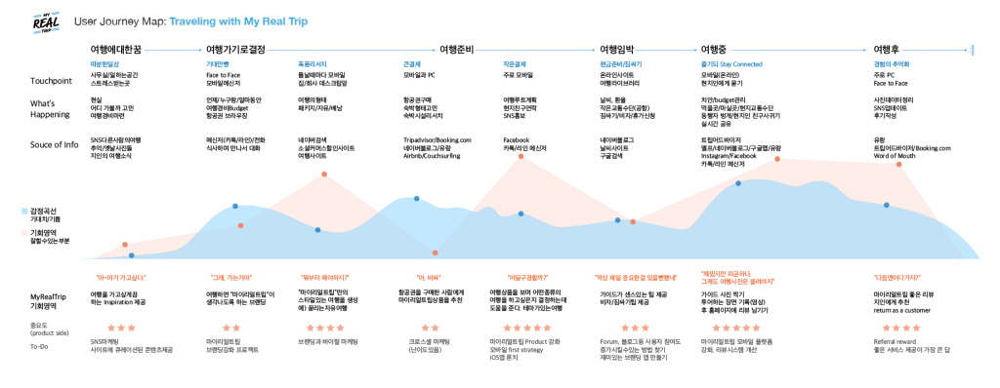
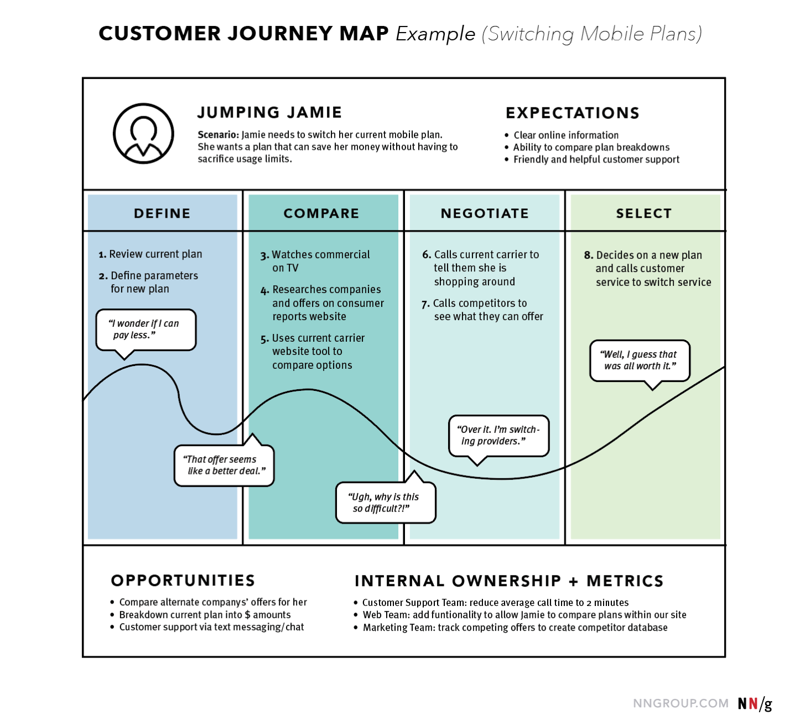

## 사용자 여정 지도 (User Journey Map)

- 사용자가 특정 시나리오에서 제품을 접하고 이용하는 과정에서 욕망과 감정이 어떻게 변화하는지를 나타내는 지도
	- 고객이 제품을 알게 되고 이용하고, 떠나는 모든 과정을 한 눈에 볼 수 있도록 하여
	- 우리가 개선할 부분, 신경써야 할 부분, 미처 놓치고 있는 부분을 파악할 수 있도록 함
- 머릿속에 있는 것과 눈 앞에 펼쳐져 있는 것은 몰입과 체감 차원에서 다름
- 여정 지도는 제품과 함께 살아있으며, 계속 업데이트되어야 함

***

### 요소

- 주인공 (Actor)
- 시나리오
- 목표 (Goal)
- 단계 (Phase)
- 감정 (Emotion)
- 페인 포인트
- 터치 포인트: 고객과 제품이 접하는 지점

---

---

