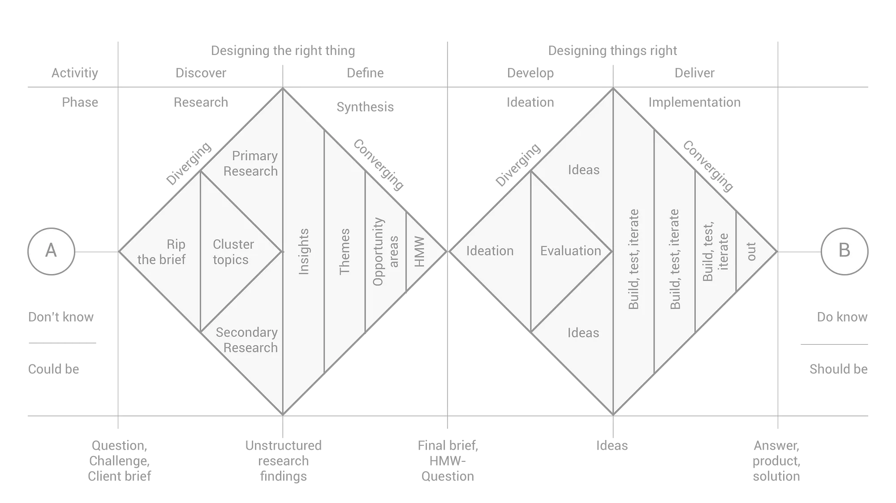
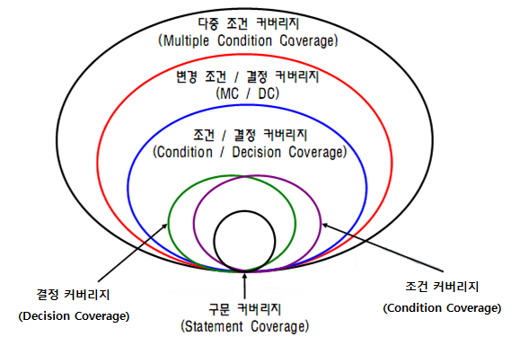

## 더블 다이아몬드 모델

- 기획의 여정은 발산과 수렴을 반복한다.

## 문제 및 요구사항 정의

### 아이디어 도출

- 아이디에이션 (Ideation)
- 이해관계자 인터뷰 (Stakeholder)
	- 이해관계자는 누구나 될 수 있다
	- 같이 일하는 조직, 해당 도메인 종사자
- 문제 정의
	- 어떠한 문제가 있고 이것은 왜 해결되어야 하나?
	- 정의된 문제는 모든 기획의 **최상위 원칙**이 된다.
		- 문제가 하위 기획에 의해 도전을 받고 수정되는 일은 있어도,
		- 하위 기획이 문제를 배반해서는 안됨.

***

### 리서치

- 데스크 리서치 (시장조사)
	- 도메인 영역에 대한 F/U 정도로 충분 (규모, 트렌드 등)
	- 선두와 후발주자들을 자세히 뜯어보고 비교하기
	- 시장 규모 예측
	- 포지셔닝 맵, 경쟁 분석

- 유저
	- 정량적, 정성적 리서치
	- 설문조사, 인터뷰, FGI
	- 기획을 유저에게 떠넘기지 말 것
		- 약은 약사에게, 진료는 의사에게, 기획은 기획자가
		- 유저는 솔직하지 않습니다
	- 가장 열성적이고 협조적인 유저 = 기획자 자신

---

### 솔루션 도출 및 가설 설정

- 문제를 해결하는 직접적인 솔루션
- 가설을 한 문장으로 나타내기!
	- ~~ 한다면 ~~~ 할 것이다!
	- 정량적 지표를 포함하면 좋음
- How Might We? 질문법

***

### 요구사항(User Story) 정의

- 문제를 해결하기 위한 세부 목표
- 유저의 직접적인 욕망을 대표하는 문장의 형태로 작성
	- `I, as a ~~~ want to ~~~~ so that ~~~~`
- 또는 일상 언어로 제품 내의 유저 행동을 표현해도 좋다

## 기능 및 화면 정의

### 기능 정의

- 기능은 요구사항에 대한 실질적 해답
- CRUD를 고려하면서 작성하기

### 화면 정의

- 화면 ⊃ 기능
	- 그러나 기능과 화면의 하이어라키는 다르다.
	- 카드 소팅, IA
- 플로우 차트, 와이어프레임, 프로토타입

## 구현 및 테스트

---

### 테스트

- 테스트 케이스
	- ID, 기능명, 화면, 환경, 재현경로, 
- 블랙박스 테스트
- 화이트박스 테스트
	- 커버리지(Coverage)
		- 구문(Statement): 전체 프로그램의 실행 완료를 검증
		- 분기(Branch): 모든 분기를 한 번씩 실행한다
		- 경로(Path): 각 조건마다 한 번씩 참/거짓을 수행하며 검증
		- 조건(Condition): All True/All False 케이스를 검증

## 유지보수 및 고도화

- 고도화 과정은 모든 디자인 프로세스를 상황에 맞게 축소하여 진행한다. 즉 미니 프로덕트를 만드는 것이라고 볼 수 있음
	- 버그 수정
	- 리팩토링
	- 리뉴얼
	- 기능 추가

### UX 고도화

- A/B 테스팅
- 유저 행동 데이터 분석