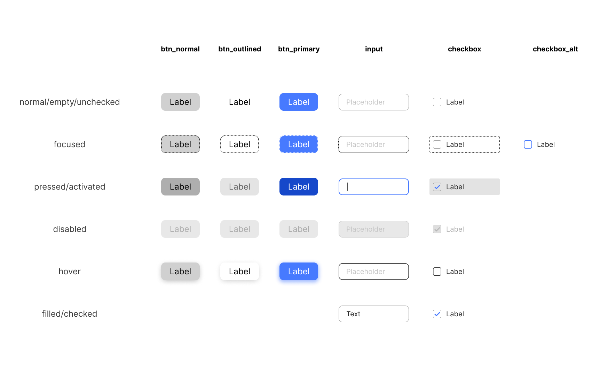
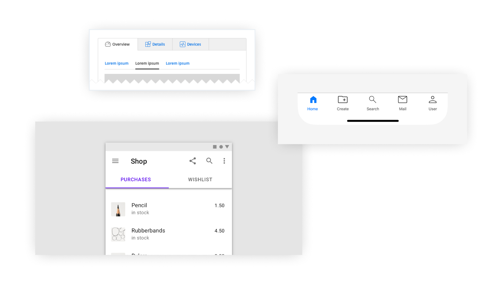

## Positioning Map

---

# 소프트웨어 기획

## 소프트웨어 개발 조직의 성격

- 전통적, 한국적 방법: 여러 문서와 워터폴 방식을 따르는 조직
- 스타트업, 해외 유래: 프로토타입과 TDD 위주의 애자일 조직

## 범기획자 직군들에 대한 소개

### 기술과 패러다임 변화에 의한 직군 다양화

- 웹마스터
- 웹기획자 / 웹 개발자
- 서비스기획자
	- Planner? Designer?
- UI/UX 디자이너
- 프로젝트 매니저
- 프로덕트 디자이너 / 매니저 / 오너 

***

- [기획자가 사라지고 있다](https://seokjun.kim/why-engineers-become-ceo/)
- [개발팀과 개발팀장이 사라져야 하는 이유](https://seokjun.kim/no-reason-for-dev-team/)

## 애자일과 워터폴

- [애자일 소프트웨어 선언](https://agilemanifesto.org/iso/ko/manifesto.html)
- 빠른 주기로 프로덕트의 개발을 반복하며 테스트 주도(Test-driven)형으로 완성품의 품질을 높여가는 소프트웨어 개발 방식
	- 유저를 내팽개치지 않음

## 스크럼

- 애자일의 실질적인 수행방법으로 스프린트를 반복해가며 프로덕트를 개발한다. 
	- 스프린트 설계
	- 스프린트 수행
	- 스프린트 회고

## 우상 숭배 금지

- 애자일
- 디자인 시스템
- REST API
- 디자인 패턴

#### 비판적으로 사고할 것!

# UI/UX 개론

## 소프트웨어를 분류하는 여러가지 방법

### 플랫폼에 의한 분류

- 네이티브
- 크로스플랫폼
	- 웹 (브라우저)
	- 자바 (가상머신)
- 하이브리드

***

### 시스템 레이어에 의한 분류

- 운영체제 (Operating System)
- 드라이버 (Drivers): 주변기기(Peripherals)를 이용하기 위한 소프트웨어
- 미들웨어 (Middlewares)
- 응용 프로그램 (Applications)

---

### 사용 목적에 따른 분류

- 오락용
- 사무용
- 교육용
- 산업용

### 공급 방법에 의한 분류

- B2B 소프트웨어
- B2C 소프트웨어

***

### 역할에 따른 분류

- 서버
	- 웹 (Web servers)
	- 애플리케이션 백엔드
	- 데이터베이스
- 클라이언트

### 의존도에 따른 분류

- 스탠드얼론(Standalone)
- Integrated
	- 의존성(Dependancy)

---

### 구축 형태에 따른 분류

- 클라우드
	- Saas (Software as a service)
- 온프레미스 (On-premise)

### 저작권에 따른 분류

- 오픈소스 (자유 소프트웨어)
- 클로즈드 소스 (또는 사유Proprietary 소프트웨어)

## 직관

- 直觀, Intuition
- 보고 아는 것

---

### 직관의 우선순위

1. 내가 아는 것
2. 내가 아는 것과 닮은 것
3. 모르지만 왠지 알겠는 것
4. 논리적으로 알아챌 수 있는 것

# UI 엘리먼트

## 입력장치

### 키보드

- 방향키, 탭 키 포커스와 Enter, Space bar 키 등을 사용해 UI 조작 가능 -> 게임패드와 비슷
- Modifier 키(Alt, Ctrl 등) 조합하여 다양한 조합의 Shortcut Key 사용가능
- 누르기, 길게 누르기

### 마우스

- 포인팅 디바이스: 2차원 평면 상의 좌표를 암시하여 해당 위치의 UI 엘리먼트를 가리키고, 클릭을 통해 실행
- 포인팅, 호버, 클릭, 더블클릭, 클릭 앤 드래그, 프레스 앤 홀드

### 터치스크린

- 화면을 직접 터치하여 마우스처럼 사용
- 탭, 탭 앤 홀드≒롱 프레스, 더블탭, 스와이프, 플릭, 핀치, 3D터치, 3-4 finger gestures

## UI를 뜯어보는 기준

- Looks: 어떻게 생겼는지
	- Status: 어떤 상태를 가지는지
- Interact: 어떤 인터랙션을 가지는지
- Data: 어떤 데이터가 암시되어 있는지

# Solitary

## Button

#### Looks

- 누를 수 있는 사각형의 영역과 버튼의 기능을 설명하는 레이블
	- 간혹 아이콘을 포함하기도
- Hover, Pressed(Active)
- 공통: Enabled/Disabled, Focused/Focused not, Empty/Filled, Validated, not Validated

#### Interact

- Activate
	- 누르기
	- 떼기

***

#### Data

- onClick : function()

---

## Radio Button

### Looks

- 눌렀을 때 속이 채워지는 동그란 버튼과 레이블
	- 이것이 여러 개 있음
- Checked, Checked not

### Interact

- Activate

### Data

- items: Item[]
- selected: Item

## Checkbox

### Looks

- 빈 사각형에 체크마크, 그리고 레이블
- Checked, Checked not, (Indeterminate)

### Interact

 - Activate, Deactivate

### Data

- checked: boolean

## Switch

### Looks

- 현실세계의 on/off 스위치를 본따, 핸들이 있고 핸들의 가동 범위 안에서 on/off의 영역이 있음
- Activated / Deactivated

### Interact

- Activate, Deactivate

### Data

- activated: boolean

## Input

### Looks

- 사각형의 입력 영역, Placeholder, Title, Cursor, (Icon), (alert)
- Empty, Filled, Error, Accepted

### Interact

- Activate
- Enter
- Validate

### 모바일에서

- [인풋 입력 시 적절한 키보드가 나와야 한다.](http://mobileinputtypes.com/)

## Slider

- 핸들과 핸들의 1차원 가동범위. 스텝 눈금
	- Range Variant
- 스텝(Steps)
- 스크롤바도 일종의 슬라이더?

### Interact

- Set

### Data

- value: number

#### 난 슬라이더가 싫어요

## Progresss bar

### Looks

- 진행상태를 나타내는 막대
- 보통 전체를 현재 진행이 채우는 형태로 작성
- Completed / In Progress / Stuck

### Interact

- 끝나기를 기다리며 하염없이 쳐다보기

### Data

- value: 0<number<=1
	- .. 인데 이 number 계산을 어떻게 하느냐가 중요

## Dropdown ≒ Selectbox, Combobox

### Looks

- 누름틀과 누르면 열리는 리스트
- Open / not open

### Interact

- Click to open
- Set

### Data

- items: Item[]
- selected: Item

# Areas & Containers

## Form

- 특정 목적의 데이터들을 입력받는 인풋들의 집합 (예: 회원가입)

## Tab

- 여러 페이지들을 묶어 버튼으로 전환할 수 있도록 추상화한 컨테이너 요소

## Dialog

- 대화상자. 

## Modal ≒ Window

- 현재 맥락과 구분되는 특정한 목적을 가지고 실행되는 독립된 작은 창
- 실행시 부모 컨테이너의 Interaction 중단됨 ≠ Modeless
- Pop-ups / Pop-over

## Screen / Page

- 가장 큰 단위의 목적을 가진 UI의 단위
- 페이지의 구분은 자의적임
- One Page One Thing
- Single Column
- 왼쪽 -> 오른쪽
	- 이전 -> 이후
	- 큰 것 -> 작은 것
	- Public -> Private

## List

- 여러 개의 항목을 보여주는 컨테이너
- Swipe actions

---

### 다양한 기기에서의 List

---

## Card

- 프로퍼티를 가진 복수 개의 복잡한 정보를 나타내는 효과적인 UI 요소
- Flat UI의 핵심

## Popup / Context Menu

- 우클릭하면 나타나는 상황에 맞는 (Contextual) 메뉴
- Dropdown과 비슷하게 메뉴 출현 위치에 대해 고민 필요

## 기타

- Splash Screen
- Accordion
- Focus
- Icon
- Carousel
- Dashboard
- Navigation Bar / Top App Bar
- Tab Bar / Navigation Bar
- Notification Bar
- Stepper / Spinner

***

- Toast
- Banner
- Popper
	- Popover
- Tooltip
- Bottom Sheet
	- Grabber
- Floating Action Button
- CTA Button
- Skeleton
- Sticky Header

## 왠진 모르겠지만 음식 이름으로 부름

- Hamburger
- Kebob
- Bento
- Toast
- Breadcrumbs

## UX 바이블

- 구글 [Material Design Guide](https://m3.material.io/)
- 애플 [Human Interface Guidelines](https://developer.apple.com/design/human-interface-guidelines)
- [Funny Worst Input Fields](https://www.boredpanda.com/funny-worst-input-fields/)

## 이름에 집착하지 맙시다

- UI 요소, 인터랙션의 정확한 이름은 찾기도 어렵고 **팀원 간 합의도 어려움**
- 따라서 혼자 정확한 이름을 쓰는 고집을 부렸을 때의 이득은 그냥 '멋있어 보인다'뿐.
- 중요한 것은 팀 내에서의 소통입니다

## 디자인 시스템

### Atomic Designs

---

- [SOCAR FRAME](https://design.socar.kr/)
- [Wanted Design Library](https://www.figma.com/community/file/1355516515676178246)
- [Gmarket Design System](https://gds.gmarket.co.kr/)
- [신한은행 SOLID Design System](http://jlworks.cool/html/work_solid.html)
- [LINE Design System](https://designsystem.line.me/)
- [11번가 Design System](https://design.11stcorp.com/)
- [리디 디자인 시스템](https://www.makerhz.me/d3ad0b6f-3698-4907-9bcd-0372db8fd4a8)
- [디지털정부 UI/UX 가이드라인](https://uiux.egovframe.go.kr/guide/index.html)

---

## 디자인 트렌드

- 스큐어모픽 Skeuomporphic
- 플랫 Flat
	- 플랫 2.0
- 뉴모피즘 Neumorphism
	- 글래스모피즘 Glassmorphism
- 네오 브루탈리즘 Neo Brutalism