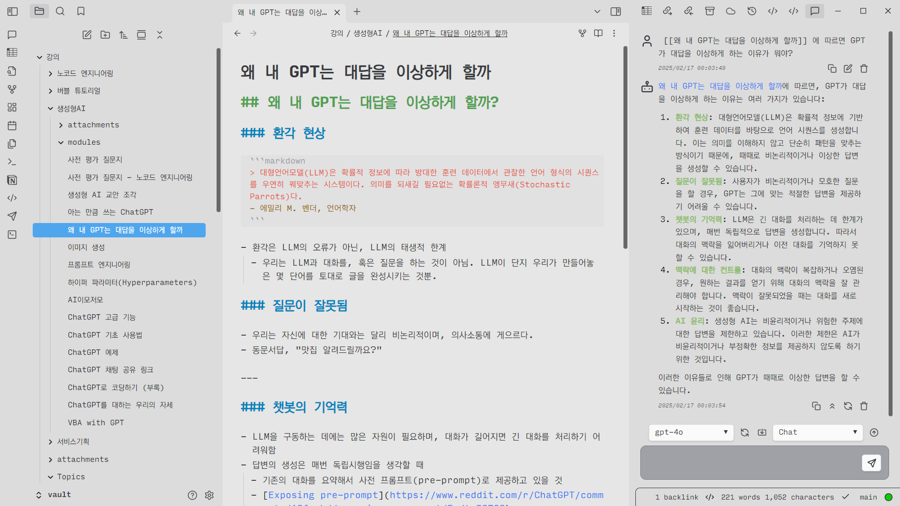

# 들어가며

# 왜 내 GPT는 대답을 이상하게 할까

# AI 이모저모

# ChatGPT 사용해보기

# 프롬프트 엔지니어링

## Obsidian과 GPT를 사용한 개인 지식DB 챗봇 구축

# ChatGPT 고급 기능 소개

# GPTs 만들기

# ChatGPT와 데이터 분석

# 엑셀과 ChatGPT

# 지금 체크해봐야 하는 AI 도구들

# 감사합니다