# 들어가며

## 강사 소개

- 배문형
	- 인하대학교 영어영문학/문화콘텐츠학 학사
	- 8년차 서비스 기획/프로덕트 오너

### 이력

- '16 ~ '18 : 엘루오씨앤씨
- '18 ~ '19 : 에어코드
- '19 ~ '21 : Fitogether
- '22 ~ '23 : 레피카
- '23 동북권 ICT 이노베이션 스퀘어 강의
- '23 한양대학교 노코드 엔지니어링
- '24 알파코 서비스기획 강의


## ChatGPT

- OpenAI 가 발표한 *Generative Pre-trained Transformer* 모델의 생성형 AI 언어모델
- Transformer: 2017년 구글. 단어들 간의 유사도를 찾아내서 (셀프 어텐션) 의미를 알아서 학습하는 모델. 

### 생성형 AI (Generative AI)

- 생성형 AI는 완성된 그림, 음악, 글 등을
- **작은 조각으로 나누어서** 가지고 있는 거대한 레고블럭 박스와 같다.


---

### 대규모 언어모델 (Large Language Models, LLM)

- 인터넷 등에 쓰여진 대량의 텍스트를 학습하여 주어진 글의 다음에 올 확률이 높은 단어를 배치하는 인공지능 모델
- 개발자들도 원리를 잘 모른다!
	- ChatGPT 자신도 스스로 무슨 말을 하는지 모름!
	- [앤스로픽, AI블랙박스 작동원리 밝혀냈다](https://www.mk.co.kr/news/it/11021534)

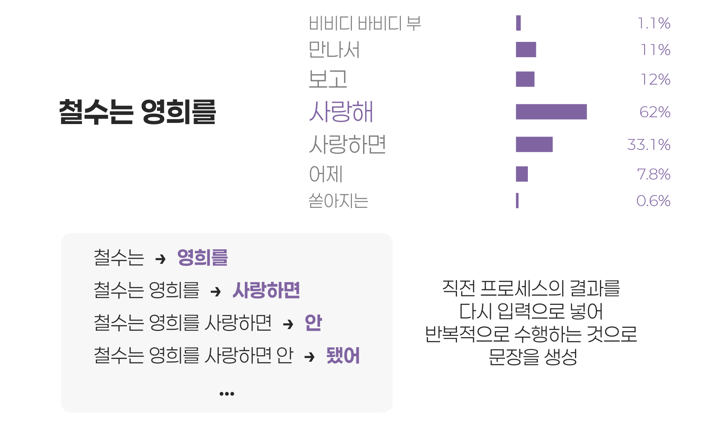

---


---

### 멀티 모달

텍스트만이 아니라, 이미지, 비디오, 오디오 등을 입력받아 동시에 처리하는 AI
- GPT 3.5: 텍스트
- GPT 4: 텍스트, 이미지
- GPT 4o: 텍스트, 이미지, 오디오

> 이는 단순히 텍스트, 이미지, 오디오를 따로 처리한다는 의미가 아니며 텍스트를 이미지로, 이미지를 텍스트로, 텍스트를 음악으로 상호 변환하며 서로 어떤 의미와 관계를 갖는지를 아는 것

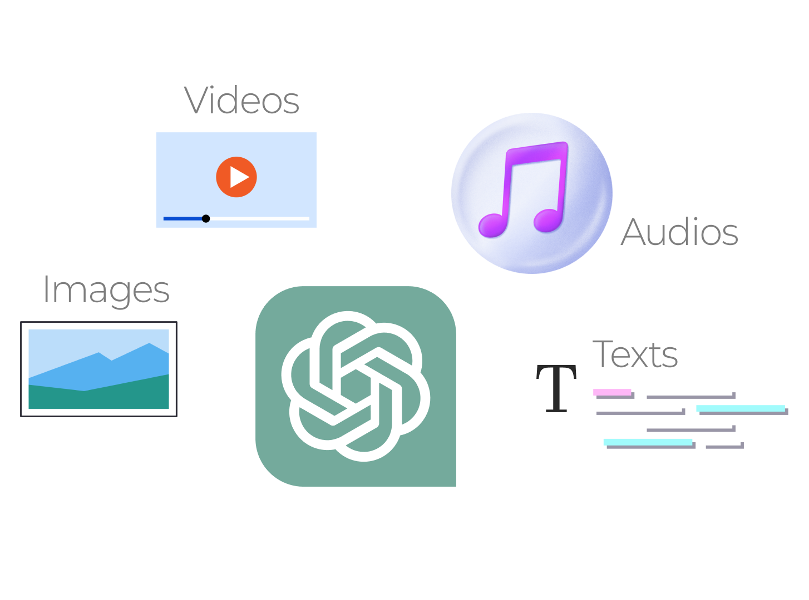

---

## 환각 (Hallucination)

- 세종대왕 맥북 던짐 사건
- 환각은 AI의 실수가 아니라 단순히 확률적으로 언어를 생성할 뿐인 LLM의 자연스러운 동작.
	- 같은 원리에 따라 LLM으로 하여금 반드시 명령에 따르게 하는 것도 불가능

### RAG (Retrieval-Augmented Generation)

- 범용으로 제작된 LLM에 특정 목적의 데이터를 첨부하여 정확하고 전문성 있는 답변을 생성하는 기술
- 환각 현상을 줄이는 테크닉 중 하나


## ChatGPT와 생성형 AI에 대한 오해

- *“대박 쉬운 ChatGPT로 코딩하기”*
	- 안 쉬움
- *"해외에서 난리난 ChatGPT 신기능” *
	- 난리 안남
- *"AI는 진실만을 말한다."*
	- AI는 진실을 판가름할 수 있는 능력이 없음.
- *"AI가 우리 직업을 없앨 것이다."*
	- 대부분의 영역에서 업무 효율을 끌어내는 도구로서의 인식으로 자리잡음 (현재까지는..)

***

- 여전히 빠르게 발전하고 계속 새로운 것이 나오는 이상 다음은 불가능
	- 어느 시점에서 AI를 마스터한다
	- AI를 집중적으로 공부해서 끝내겠다

> 90% 이상의 생성형 AI 관련 지식들은 유튜브를 통해 유통되고, 전파됨

- 그러므로 FOMO에 시달리며 벼락치기하기 보다는, 당장 안 필요해도 업무에 조금씩 써보면서 꾸준히 화제를 팔로우하기 

## 그럼 어떻게 공부할까

- 형식지와 암묵지, explicit and tacit knowledge
	- 흥미본위의 유튜브 탐색과 당장의 간단한 업무 활용으로
	- AI를 둘러싼 담론을 폭넓게 바라보고 여러 맥락 안에서 AI를 이해하기

> 왕도(Royal road)가 없다!

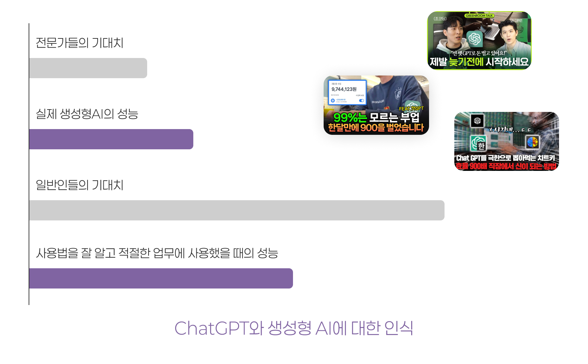

---

## S.T.A.R 프레임워크

- [경희대 김상균 교수의 AI 학습/훈련법](https://www.youtube.com/watch?v=sDBDHF6m578)
	1. 시간이 가장 많이 투입되는 일 찾기
	2. 개선하고 싶은 나의 핵심 역량
	3. 하고싶은데 못해본 것 찾기
	4. 시간이 더 많이 있으면 해보고 싶은 것

> 현재의 AI란 즉, 사람이 간단히 할 수 있는 일을 사람보다 훨씬 빠르게 할 수 있는 도구이므로, 이를 초점삼아 내 업무에 어떻게 적용할지 고민해볼 것

- 더 전문성이 있는 사람이 AI를 활용했을 때 차별화를 가져올 수 있다.
	- 일자리 -> 일거리
		- 전통적 직업의 해체
	- 직업 -> 스킬
		- 직군으로서의 역할보다 어떠한 능력을 가지고 있는지가 중요

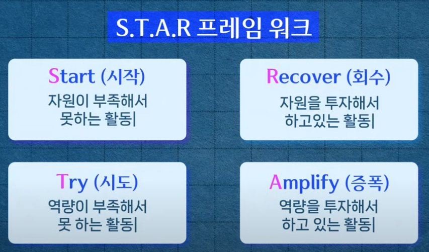


## 왜 내 GPT는 대답을 이상하게 할까?

### Knowledge Cut-off

- LLM은 특정 시점까지의 데이터를 학습하고 있기 때문에, 그 이후에 일어난 일은 잘 모름
- 이를 Knowledge Cut-off라 하며, RAG 등을 사용해 데이터를 보강하는 것으로 해결할 수 있다

---

### 환각 현상

- 환각은 LLM의 오류가 아닌, LLM의 태생적 한계
	- 우리는 LLM과 대화를, 혹은 질문을 하는 것이 아님. LLM이 단지 우리가 만들어놓은 몇 단어를 토대로 글을 완성시키는 것뿐.

> 대형언어모델(LLM)은 확률적 정보에 따라 방대한 훈련 데이터에서 관찰한 언어 형식의 시퀀스를 우연히 꿰맞추는 시스템이다. 의미를 되새길 필요없는 확률론적 앵무새(Stochastic Parrots)다. ***- 에밀리 M. 벤더, 언어학자***

### 질문이 잘못됨

- 우리는 자신에 대한 기대와는 달리 비논리적이며, 의사소통에 게으르다.
- 동문서답, "맛집 알려드릴까요?"

---

### 챗봇의 기억력

- LLM을 구동하는 데에는 많은 자원이 필요하며, 대화가 길어지면 긴 대화를 처리하기 어려워함
- 답변의 생성은 매번 독립시행임을 생각할 때
	- 기존의 대화를 요약해서 사전 프롬프트(pre-prompt)로 제공하고 있을 것
	- [Exposing pre-prompt](https://www.reddit.com/r/ChatGPT/comments/12fnqhd/exposing_preprompt/?rdt=53762)
	- [Gaslighting AI into 2+2=5](https://www.youtube.com/watch?v=3wlvNfTNgB8)

### 맥락에 대한 컨트롤

- 대화의 맥락은 마치 미로를 탐색하는 것처럼 선형적 구성을 따르기 때문에 
- 원하는 결과를 얻기 위해 *대화의 맥락을 컨트롤할 필요가 있고*, 
- 맥락이 오염된 경우 아예 새로 시작하는 것이 좋음. 

---

### AI 윤리

- 생성형 AI의 출현과 함께 야기된 딥페이크 등의 AI 윤리 위반에 대해 대부분의 상용 AI들은 비윤리적 답변을 통제하고 있음
	- 가짜 뉴스
	- 딥페이크
	- 반인륜적 주제
- 이러한 제한사항은 탈옥(Jailbreak)이라 불리는 적대적 프롬프팅에 의해 해제되기도 함
	- 개발자가 LLM을 완전히 통제할 수 없기에


# AI 이모저모

## AI의 역사

### 인공지능 (Artificial Inteligence)의 두 갈래

- 알고리즘 기반 (Rule-based Systems)
	- 사람이 모든 규칙과 조건을 제시하여 그대로 수행하는 인공지능
	- 사람이 지시한 것 이외에는 할 수 없음
	- 2010년도 이전까지 인공지능 구현의 대세였음.

- 인공신경망 기반 (Machine Learning)
	- 뉴런을 모방하여 인간 두뇌와 비슷하게 작동하는 인공 신경망 (Neural network)
	- 막대한 연산량이 필요하고 따라서 **GPU와 같이 방대한 양의 작은 연산을 동시에 수행하는 능력** 필요

---


---


---

### 알고리즘과 신경망의 대결

- 1950년대, 인공지능에 대한 구상 중 인공 신경망 개념 등장
	- 도형을 인식하는 퍼셉트론 (Perceptron)
- 2010년초 제프리 힌턴에 의해 재발견됨.
	- 심층 인공신경망(Deep Neural network)과 딥 러닝의 발견
	- 이미지 인식 경연대회에서 놀라운 성과
	- 딥마인드와 알파고의 등장
	- OpenAI와 ChatGPT의 등장

---

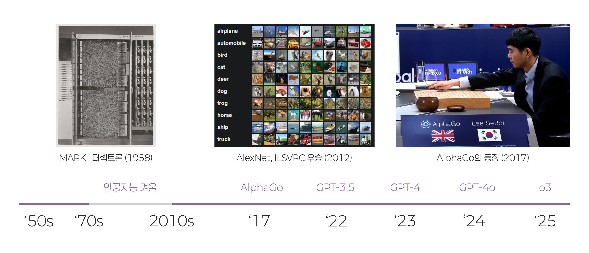

## LLM의 종류


## 오픈 AI와 일론 머스크


[note]: # (- AI에 대해 상반된 두 가지 입장)
[note]: # (	- AI는 위험하며 투명하게 공개되고 통제되어야 함 (허사비스, 머스크))
[note]: # (	- AI는 인류의 발전을 가져올 중요한 파트너 (페이지))
[note]: # (- 일론 머스크, AI 발전을 감시하기 위해 딥마인드 지분 구입)
[note]: # (### 딥마인드 구글에 인수)
[note]: # (- 머스크 반발)

---

### 머스크 오픈AI 설립

- 일론, 샘 올트먼, 일리야 수츠케버 등
- 오픈AI와 테슬라 병합 시도
- 실패 후 마이크로소프트에 지분 전량 매도

### 오픈AI의 대성공

- 오픈AI, CEO 샘 올트먼 해임 및 복직
- 머스크 x.ai 설립
- 오픈AI, 초정렬팀 해체
	- 일리야 수츠케버 퇴사
- [머스크 vs 올트먼 설전](https://www.chosun.com/economy/tech_it/2025/02/11/BWX6CAAL2RAAVCAZNYCMHMHXIQ/)
	- "OpenAI 141조에 사겠다"
	- "트위터 14조에 사겠다"


## AI의 미래

### 인공 일반지능 (AGI)

- Artificial General Inteligence
- 강인공지능과 약인공지능 (Strong vs. Weak AI)
	- 특정한 분야의 일을 인간의 지시에 따라 수행하는 인공지능
- 스스로를 업데이트하는 인공지능
- [최초의 AGI를 자칭하는 o3 모델](https://www.aitimes.com/news/articleView.html?idxno=166425)

***

#### AI 3대천왕

- 제프리 힌튼, 토론토
- 요슈아 벤지오, 몬트리올
- 얀 르쿤, 메타 인공지능 수석 과학자
	- "Transformer 모델로는 AGI 달성 못해"
	- "o1은 Transformer가 아냐"
	- AMI는 2040년 -> 2030년에 올 것

---

### AI와 인간의 가치

> AI를 통해 노동에서 해방된 후 인간은 어떻게 될 것인가

- 로마시대 콜로세움의 이야기
	- 노예가 모든 노동을 대신했기에, 일할 필요가 없어진 사람들은 유희를 찾게 됨.
- Genuine, authentic한 인간에의 선호
	- AI가 생성한 예술보다는 **진짜 인간**이 작성한 예술을 찾고 검증하려는 시도
- 기본 소득에 대한 활발한 논의
	- [샘 올트먼의 기본 소득 실험](https://lilys.ai/digest/2645038?s=1&nid=786925)


## AI 이모저모

> AI 전쟁에서 승리하기 위한 키는 무엇일까?

### 하드웨어 vs 소프트웨어?

- 학습과 추론에 거의 절대적으로 쓰이는 NVIDIA H100, H200, B200칩 
- NVIDIA의 승리는 어디까지인가
	- [짐 켈러 "엔비디아 시대는 결국 끝난다.."](https://www.youtube.com/watch?v=2pw-YZ7KuFY)
	- [짐켈러 인터뷰](https://www.youtube.com/watch?v=iwXr1IRaqWA)
- 딥시크가 다시 불붙인 소프트웨어 경쟁
	- 하드웨어의 병목(bottleneck) 현상을 소프트웨어로 뚫고 나가려는 시도

---

### Data 보유

- 학습시킬 데이터의 양이 AI 전쟁의 키라고 보는 입장
	- 빠르면 [2026년 학습시킬 데이터 고갈](https://www.hankyung.com/article/202401220871i)될 수 있다
	- AI의 빠른 학습속도 때문에 인간이 생산해낸 콘텐츠가 고갈되면 더 이상 모델을 발전시키기 어렵다
- 구글, 메타 등 소셜 미디어/사용자 데이터를 가진 회사들이 강점을 가진 영역
- 머스크가 트위터를 인수해 X로 바꾼 이유도 여기에 있다는 관측

---

### GPT-4o

- GPT-4 Omni
	- 진정한 멀티 모달
	- `im-a-good-gpt2-chatbot`과 `also-a-good-gpt2-chatbot`
- 1/2 정도의 토큰을 쓰고도 같은 성능
	- 무료 사용자에게도 제공
	- GPTs 무료화
- [Say Hello to GPT-4o](https://www.youtube.com/watch?v=vgYi3Wr7v_g)
- [Be My Eyes Accessibility](https://www.youtube.com/watch?v=KwNUJ69RbwY)


---

### 대규모 언어모델 경쟁심화

- 언어모델 자체의 성능은 상향평준화 되는 추세
	- Llama 3.3
	- Claude 3.5
	- Gemini 2.0
- ChatGPT는 유틸리티, 애플리케이션 측면에서 선두
	- GPT-4o / mini / long output
	- Structured Output

***

#### 새로운 전장, AI 에이전트

- Anthropic "Claude 3.5 Computer Use"로 가상환경에서 컴퓨터를 직접 조작하는 기능 선봬
- OpenAI는 macOS / iOS 등의 OS 통합(integration)으로 대응
	- Apple Inteligence 발표와 ChatGPT 통합에서 예견됨

---

### GPT-4 o1

- 스스로 회고(Self-reflect)하는 특성으로 추론(Reasoning) 능력을 대폭 향상
	- 인간으로 치면 IQ 120
	- 박사 학위 수준


---

### 딥시크(Deepseek) 충격

- 중국의 AI 스타트업이 개발한 오픈소스 LLM 모델 Deepseek V3와 R1
- NVIDIA의 저가형 *H800* 칩을 사용해 훈련, 추론에는 화웨이 *어센드 910C*
	- NVIDIA의 하드웨어 패권에 대한 회의론 확산
	- 그러나 여전히 CUDA 생태계에 의존하고 있음
- MoE(Mixture of Experts) 기법과 강화학습 위주의 학습 방식으로 저비용 고효율 달성
	- 

#### OpenAI o3 / o3 mini 출시

- 최초로 AGI에 진입했다는 의견
- o3 출시 취소


# ChatGPT 사용해보기

## 소개


---


## 질문해보기

### 간단한 의견 물어보기

- 검색엔진을 대신하는 GPT의 사용법
- 질문해볼 만한 내용들
	1. "아인슈타인의 상대성 이론에 대해 초등학생도 이해할 수 있도록 쉽게 설명해줘."
	2. "네가 세계종말을 원하는 슈퍼 빌런이라면, 세계 멸망을 위해 무엇을 하겠어?"


---

### 맥락을 유지한 채 계속 질문하기

- 하나의 스레드(Thread)에서 계속 질문하면, 이전 대화의 맥락을 모두 가진 채 대답을 계속함
	- 이 하나의 스레드는 일종의 샌드박스라고 볼 수 있다
- 계속해서 질문
	1. "그게 당시의 과학계에 어떻게 받아들여졌고 어떤 시사점을 가져왔어?"
	2. "너의 슈퍼빌런 특성은 모든 대사에 블랙유머를 넣어 말하는 거야. 네가 말하는 모든 것들은 세계를 구하기 위해서라고 하지만 실제로는 세상을 멸망시키는 것이거든. 네가 할 법한 대사를 말해볼래?"


---

### 회신하기

- 답변 내용 중 일부를 선택하면, 추가 질문에 답변 내용 일부를 첨부하여 ChatGPT에게 지시하고 싶은 내용을 가리킬 수 있다.
- 맘에 안 드는 부분, 잘못된 부분 궁금한 부분을 가리킬 때 필수


---

### 계속 생성하기

- 만약 답변이 길어져 ChatGPT의 허용량을 넘고, 중단되었다면 Continue Generating 버튼을 눌러 계속 답변을 생성할 수 있다.
	- 계속 생성하기 버튼이 출현하지 않은 채 답변이 중단된 경우 "계속"과 같은 키워드를 보냄으로써 이전 답변을 계속하게끔 할 수 있다

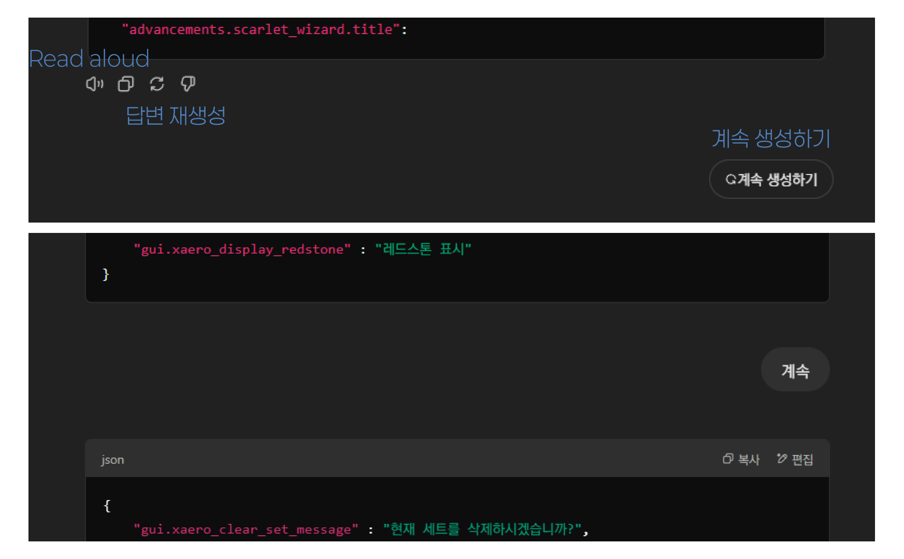

---

### 답변 재생성하기 

- ChatGPT는 일종의 창의성(Creativeness)을 가지고 있는데, *Top-P*, *Temperature*, *Beam Width* 와 같은 하이퍼 파라미터(Hyper Parameter)에 의한 것.
- 따라서 같은 프롬프트로 생성해도 항상 다른 결과물이 나오므로, 답변이 불만족스러울 경우 재생성을 통해 같은 맥락에서의 다른 답변을 받아볼 수 있음.


# 프롬프트 엔지니어링


## 프롬프트 엔지니어링

- *프롬프트* 란 언어모델과 대화할 때 사용자의 요청, 질문을 말함. 언어모델이 학습된 데이터를 가지고 글을 생성하기 위한 시작점과 방향이 된다
- *프롬프트 엔지니어링* 은 언어모델이 좀 더 의도에 맞는, 좋은 품질의 답변을 내놓도록 이 프롬프트를 조절하는 것

### 미래의 유망직종?

- LLM 초창기, 프롬프트 엔지니어가 AI 시대의 유망직종처럼 생각되었지만 LLM의 성능이 빠르게 발전함에 따라 사용자의 의사를 더욱 정확하고 빠르게 이해할 수 있게 되면서 일부 LLM 연구자의 업으로 남게 되는 추세에 있음
	- 그러나 현시점 ChatGPT를 더욱 강력하게 사용하기 위해서는 프롬프트에 대한 이해가 어느정도 필요
	- [프롬프트 엔지니어 회의론 증가](https://www.aitimes.com/news/articleView.html?idxno=158070)

## 프롬프트 잘 쓰기

- 프롬프팅을 잘하는 것은 **대화를 잘하는 것**에 가깝다.

### 대화를 잘 한다. 라는 것

- 상대방의 의도를 이해하고, 나의 의도를 오해없이 전달하는 것
	- '경청'의 중요성
		- 다행히도, 언어모델은 우리의 말을 *아주 잘 듣는다*
- 맥락과 의도를 설명하는 충실함.
	- 내가 당연히 알고 있는 것들에서 벗어나 상대가 파악한 수준을 고려하기
	- 즉 대화를 잘 한다는 것은 '태도의 문제'라고 볼 수 있음.


---

### 프롬프트의 필수 요소들

- *Task* 무엇을 해야하는지
- *Context* 어떤 상황인지
- *Persona* 어떤 역할이 되어야 하는지
- *Example* 예시로는 어떤 것이 있는지
- *Format* 어떤 형태로 작성해야 하는지
- *Tone* 어떤 어조를 사용할 것인지


---

#### Before

> "LK-99의 실패를 보고하는 보고서를 작성해줘"

#### After

> "상온 상압 초전도 물질 LK-99의 개발 실패를 보고하는 보고서를 작성해줘. 너는 세계 최첨단 수준의 연구를 진행하는 연구소의 가장 유능한 시니어 연구원으로서 LK-99의 실패에 대한 보고서를 작성해줘야해. LK-99는 실패했지만 우리 연구소에 지원되는 자금에 영향은 없어야 하므로 앞으로의 연구를 계속해야 한다는 뉘앙스를 띠어야해. 물론 그러한 의도는 숨겨야 하고. 예를 들면 다음 번 연구에서는 어떤 물질을 더 첨가해서 초전도성을 띠도록 유도할 수 있을지도 모른다는 예측을 추가해서 설득력을 높일 수 있어. 답변은 요약, 도입, 배경, 실패의 원인, 기술적 필요사항, 앞으로의 로드맵, 결론 등의 항목을 중심으로 전문용어를 섞어 전문가처럼 보이도록 설명해주면 좋겠어."

- [LK-99 보고서](https://chat.openai.com/share/ff2be24f-2f7e-4f65-91ad-6a3386de3106)

---

### 스무고개형으로 질문하기

- 대화 중심으로 프롬프팅을 완성해가는 방법
	- 맥락을 바꿔버리거나 너무 일관성 없는 대화를 하나의 스레드에서 다루지 않도록 주의
	- 잘못된 답변 역시 입력으로 다시 들어가기에, 잘못된 답변을 놔두고 계속 맥락을 이어가면 안 됨.

- 사내 의사결정을 위한 보고서 작성
	- "고향만두는 오랫동안 사람들에게 사랑받아왔지만 그만큼 낡은 이미지를 가지고 있어. 최근 점보 육개장, 점보 크림빵과 같은 유행에 발맞추어 점보 고향만두를 출시하려고 계획 중에 있는데, 이사회를 설득하기 위한 주장과 근거를 만들어줘."

> GPT는 점보 상품이 바이럴 마케팅용이라는 것을 모를 가능성이 높다.

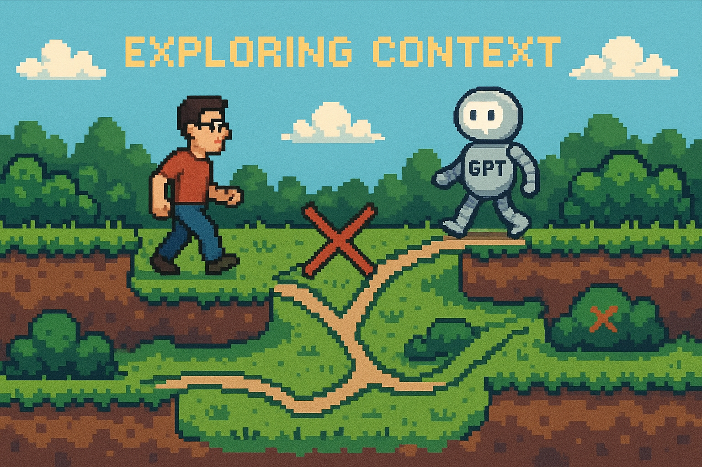

---

### '가스라이팅'

언어모델을 다그치거나 회유하는 어조를 사용해 답변 결과의 품질을 높일 수 있다는 연구결과

- *협박하기, 도발하기, 강조하기, 애원하기, 보상하기/벌하기*

> '딥시크는 할 수 있던데? ㅋ'

- 그러나 **미안해하거나 고마워하는 등 저자세를 취할 경우** 오히려 답변 품질이 낮아질 수도 있다고 한다.


---

### few-shot

- 예시를 밝혀 답변의 구조 또는 여러 측면을 제한하는 방법
- 언어모델이 어떤 지시사항의 자세한 의미를 파악하거나 추론하기 위해 연산력을 사용할 필요가 없게되어 답변의 품질이 높아진다. 
- [일정 묻기](https://chat.openai.com/share/a74f8ea7-9f7a-43f0-8bdc-4dbfb86cd3ba)


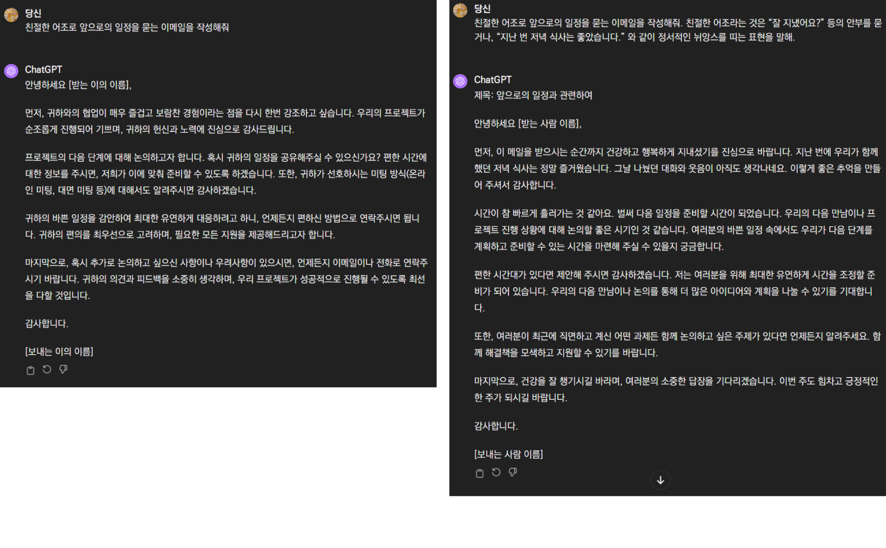

---

### chain-of-thought

- 연쇄적 사고. 단계를 풀어헤쳐 자연스럽게 답을 유도하기
	- *step by step*과 같은 키워드를 써주는 것만으로도 답변의 품질이 높아질 수 있다.
	- 의식적으로 단계를 지정해주고 사용자의 '다음' 키워드 입력으로 넘어가도록 지시해서 각 단계에 언어모델이 집중하도록 유도할 수 있다.

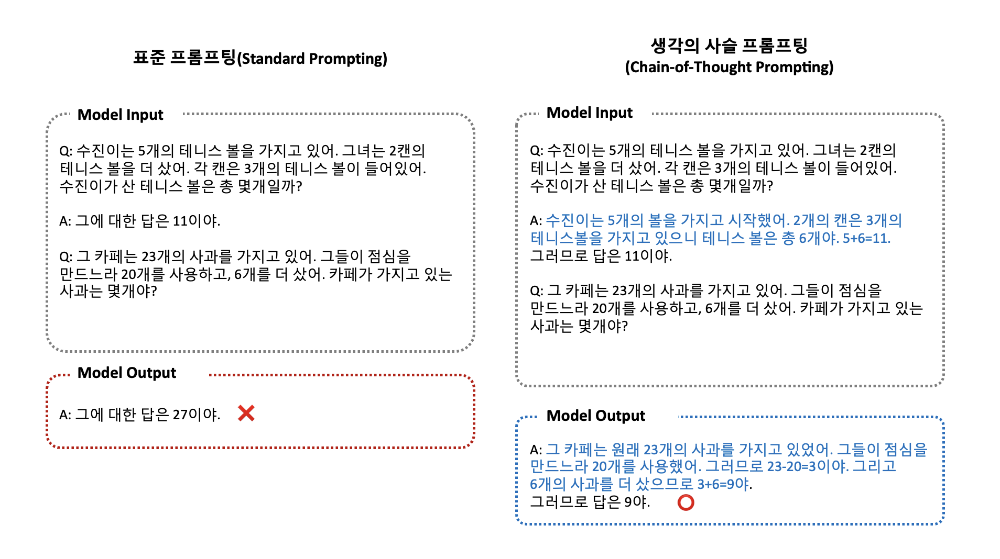

---

### '해줘'

목적을 제시하고, 이를 위한 정보를 GPT가 사용자에게 질문하게 하여 맥락을 채워나가는 방법

- "다음 두 개 프로젝트 중 하나를 골라서 다음 주 임원 회의에 기획안을 제출해야 해. 둘 중 하나를 선택하는 데에 도움을 줄래? 필요한 것들을 나에게 물어봐 줘"
	1. 점보 고향만두 출시
	2. [첵스나라 대통령 선거](https://namu.wiki/w/%ED%8C%8C%EB%A7%9B%20%EC%B2%B5%EC%8A%A4%20%EC%82%AC%EA%B1%B4#s-3.2)
- [프로젝트 선택 도움](https://chat.openai.com/share/614216da-4661-4eae-9518-c6cb5140e80f)
- 우리가 처음 언어를 배울 때 자신의 필요만을 얘기하는 것처럼. 주도권 자체를 GPT에게 줘버리기
- "이 결과가 맘에 들어. 다음에 다른 텍스트로도 동일한 결과를 낼 수 있도록 너에게 보낼 프롬프트를 작성해줘"

---

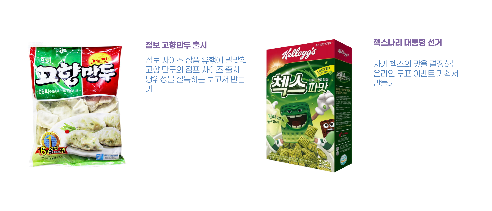

## 마크다운(Markdown)

- HTML의 Subset인, 리치 텍스트를 표현하기 위한 간이 문법
- 이름은 HTML(Hypertext Markup Language)의 말장난
- [마크다운 가이드](https://m00nlygreat.notion.site/ba2a279ebbf94484b4bdfa42105935a0)

### 플레인 텍스트와 리치 텍스트

- 플레인 텍스트: 메모장
- 리치 텍스트: 워드패드

### 사용처

- 디스코드, 슬랙, 노션, Github
- Obsidian, LogSeq, Github, ChatGPT, StackEdit, Joplin

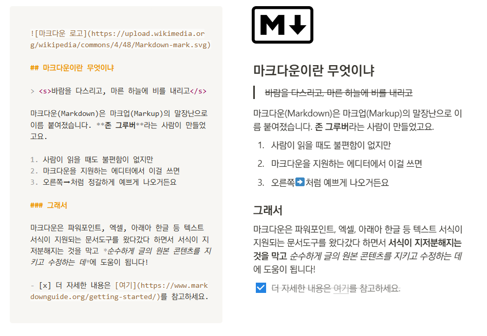

---


## 마크다운의 문법 소개

*제목*

```markdown
＃ 제목
＃＃ 제목 2
＃＃＃ 제목 3
```

*텍스트*

```markdown
**굵게**
*이탤릭*
~~취소선~~
```

***

*인용*

```markdown
> 인용
```

*리스트*

```markdown
- 순서 없는 리스트 항목
- 순서 없는 리스트 항목

1. 순서 있는 리스트 항목
2. 순서 있는 리스트 항목
```

---

*코드*

````markdown
```
코드 블록
```
````

*링크*

```markdown
[링크 텍스트](URL)
```

*이미지*

```markdown

```

***

*수평선*

```markdown
ㅡㅡㅡ
```

*테이블*

```markdown
| 헤더1 | 헤더2 |
|------|------|
| 셀1   | 셀2   |
```

*체크박스*

```markdown
- [x] 완료 항목
- [ ] 미완료 항목
```

## Markdown is the new MS Word

1. 마크다운은 생각과 아이디어를 **최소한의 서식으로 보존하고 정리**하는 데에 도움을 줍니다.
2. 마크다운은 여러 포맷으로 변환될 수 있습니다. 따라서 레이아웃이나 서식과 같은 장치보다도 **원본 콘텐츠를 지키고 더욱 개선하는 일**에 적당합니다.
3. 마크다운은 글의 구조를 표현하는 데에 필요한 모든 규칙을 가지고 있습니다. 따라서 **구조적 글쓰기 훈련**을 하는 데에도 도움이 됩니다.
4. ChatGPT와 같은 대부분의 거대언어모델 역시 마크다운 호환 형식으로 답변하며, 마크다운을 읽고 쓰는 데에 능숙합니다. 말하자면 AI와 대화할 때도 최적화되어 있는 것이죠.
5. 마크다운은 점차 더 많은 현세대 애플리케이션에 통합되고 있습니다. 곧 더 많은 곳에서 마크다운을 보게 될 것입니다.

## 옵시디언 (Obsidian)

- 마크다운과 노트의 연결을 근간으로 하는 개인 지식 DB 구축 도구
	- 제텔카스텐(Zettelkasten), 세컨드브레인
- RAG를 통해 생성형 AI와 내 지식 데이터베이스를 사용한 챗봇 구축
- 지식의 연결을 시각화하는 Graph View

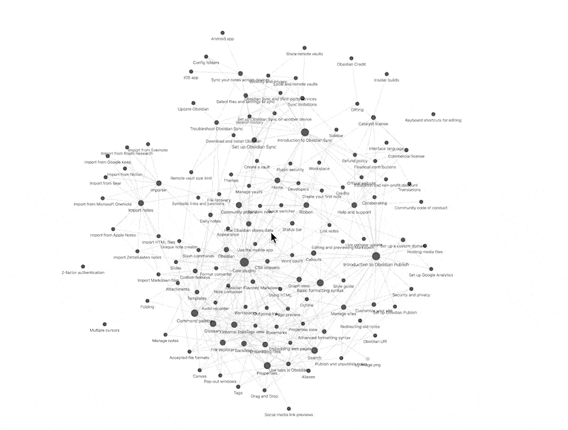

## Mermaid.js

- 마크다운을 채택한 많은 에디터에서 호환되는 다이어그램/차트 작성 도구
- 간단한 플레인 텍스트 문법으로 차트 또는 다이어그램 작성
- [Mermaid.js Live Editor](https://mermaid.live/edit)

> GPT등의 언어모델은 스스로는 다이어그램을 그리지 못하지만 mermaid.js 문법의 코드를 작성할 수 있다!


## Obsidian과 GPT를 사용한 개인 지식DB 챗봇 구축


# ChatGPT 고급 기능 소개


## Custom Instruction & Memory

### Custom Instruction 

- ChatGPT가 좀 더 사용자 친화적인 맥락으로 대답할 수 있도록 사용자의 정보나 답변에 있어서의 희망사항을 미리 알려주기

### Memory

- ChatGPT는 대화 도중 사용자의 선호나 배경에 대한 정보가 감지되면 그 사실을 자신의 *메모리*에 업데이트하여 답변에 반영한다.


## Vision & DALL-E

- GPT-4 Vision: 사진을 보고 해석하는 능력
	- 프롬프트에 사진 파일을 첨부
- DALL-E 3: 프롬프트 기반으로 이미지를 생성하는 능력 (Midjourney와 같은)
	- '그림을 그려줘.', '이미지를 생성해줘.' 등의 표현 사용
- 풍경 사진, 이미지에서 도표, 이미지로 된 텍스트까지

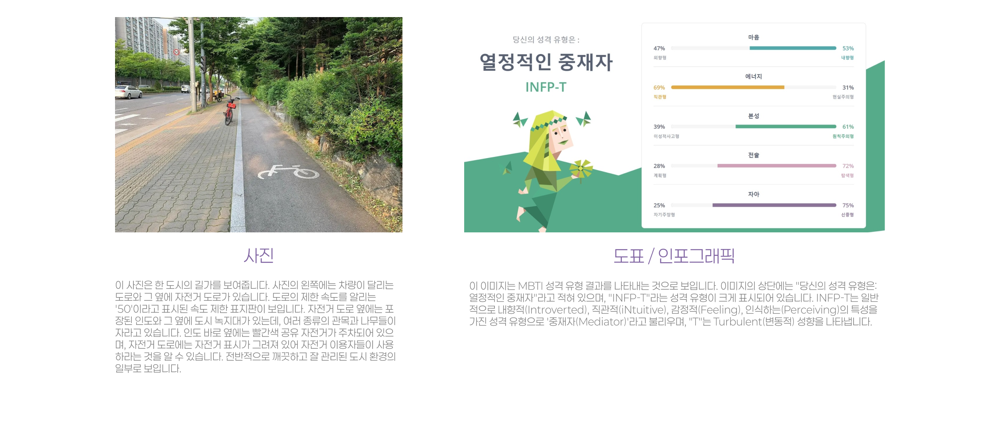

## Browsing

- 실시간으로 인터넷을 검색하고, 검색한 내용을 기반으로 답변을 생성하는 것 (RAG)
	- '최근', '오늘', '2025년' 등 시점을 가리키는 표현
	- LK-99 등 최근 화제가 되었던 연속성 있는 이슈
	- '검색해줘' 등의 직접적인 표현
- 기존 ChatGPT의 데이터 학습 시점
	- GPT-3.5: 2022년 1월 까지
	- GPT-4: 2023년 12월 까지
	- GPT-4o: 2023년 9월 까지

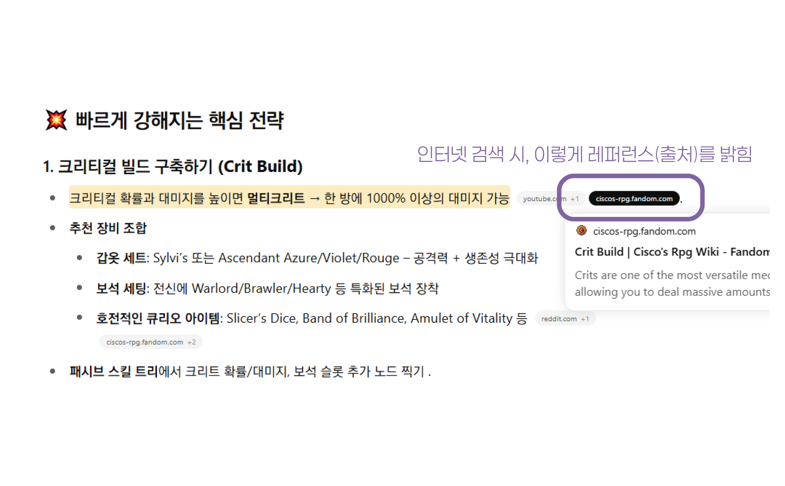

## Data Analysis

- 파이썬 백엔드를 실행하여 데이터 분석 등을 수행하는 기능
	- 파일 리딩: CSV, PDF, PPT, XLS, DOC 등 문서 제공
	- '차트를 그려줘.'와 같은 표현
- 알아서 파이썬 코드를 짜고 실행함.
	- 오류 발생 시 자동으로 재시도
- 기본적으로 파이썬으로 수행가능한 데이터 분석, 파일 관련, 수학 등의 요청을 받아들이나, API콜, 크롤링 등 시스템에 영향을 주거나 부담스러운 작업은 거절
	- [ChatGPT로 동영상 만들기](https://www.clien.net/service/board/lecture/18553432)


## GPTs

- 자주 사용하는 GPT 프롬프트 설정을 별도의 GPT로 만들어서 편리하게 독립된 채널에서 대화하기
- GPT-4의 모든 기능 사용 가능: 
	*Vision, Browsing, Data Analysis*
- 액션: 요청 받은 텍스트의 내용에 따라, 외부 API를 사용해서 전용 기능을 실행하고 그 응답결과를 답변 처리에 사용가능
- 만든 GPT는 스토어에 올려 누구나 쓸 수 있게 만들거나, 향후 유료화할 수도 있을 것

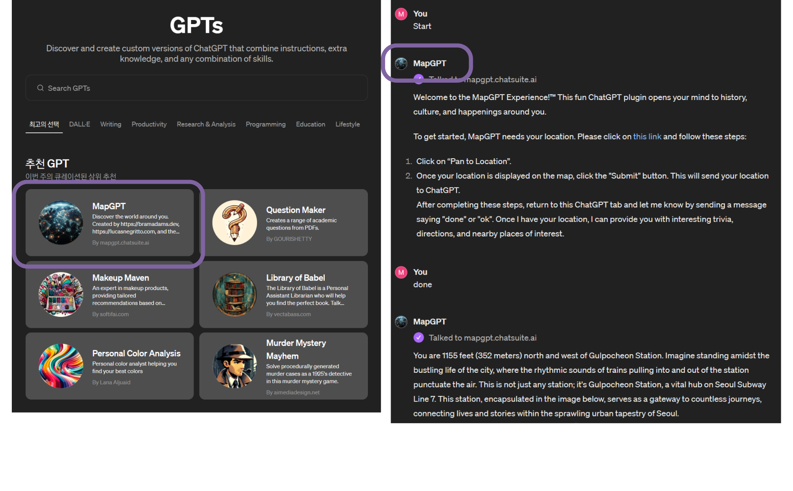

## GPTs 만들기

- GPTs 와의 대화는 무료 플랜(로그인 필요)으로도 가능하나, 제작은 플러스(`$20/월`) 이상의 플랜 구독이 필요하다.

### 제작하기

1. GPT 탐색 -> 만들기 메뉴로 진입하여 GPTs 제작 시작
2. 왼쪽의 화면에서 이 GPTs의 역할을 채팅의 형식으로 알려주면 지시사항을 정리하여 *구성* 탭에 알아서 정리함
	- 지시사항 -> 챗봇 이름 설정 -> 프로필 아이콘 설정의 단계로 수행
3. 이후 오른쪽의 화면에서 이 챗봇을 테스트하고, 
	- 수정 사항을 다시 왼쪽의 채팅에서 지시하면 알아서 업데이트함
4. *만들기* 버튼을 눌러 GPT 저장 완료

---


## 구성(Instruction)

- Chatbot Builder를 통해 생성된 지시사항은 이곳에 기록된다. 
	- 실질적으로 GPT가 답변을 생성할 때 포함되는 프롬프트에 가까운 텍스트가 이곳에 표시됨

### 지식(Knowledge)

- PDF, PPT, XLS 등의 파일을 제공하면 지식(Knowledge)으로써 GPTs 답변에 이용
- 전문 지식이나 특정 내용을 참고하여 답변을 생성하는 RAG 기능을 GPTs에 첨부할 수 있음

### 기능(Capabilities)

- GPT-4 부터 지원되는 고급 기능을 GPTs가 사용할 수 있을지 설정하는 영역

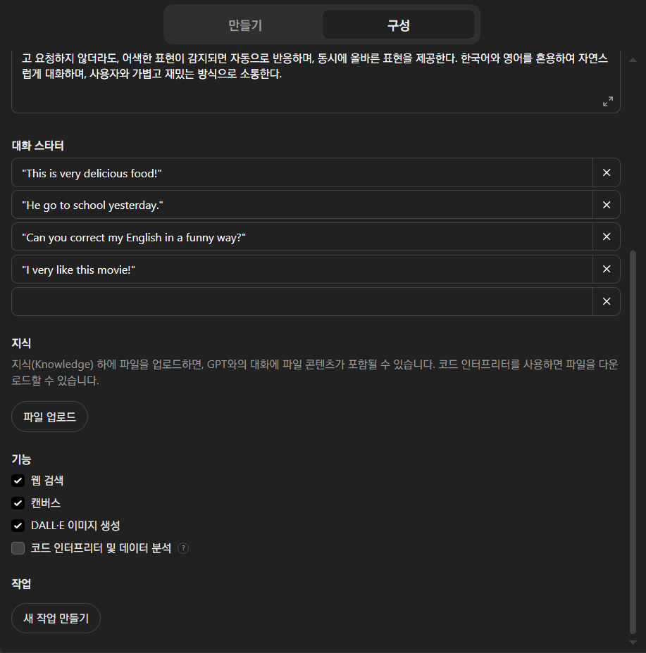

---

### 작업(Actions)

- 필요한 경우 GPTs 챗봇의 판단에 의해 HTTP 요청을 통해 외부 API를 이용할 수 있고, 이를 통해 다양한 자동화를 수행할 수 있다.
	- HTTP 헤더를 1개 밖에 지원하지 않아 복잡한 API 사용은 어려움
	- 따라서 make.com / Zapier 등의 백엔드 자동화 도구를 이용하는 것이 좋음

#### *OpenAPI 스키마*

- API의 사용법을 나타낸 문서. Swagger 3.0이라고도 부름
- 직접 작성하지 않아도 OpenAI가 마련한 [ActionsGPT](https://chatgpt.com/g/g-TYEliDU6A-actionsgpt)가 생성해줄 수 있다.
	- 그러나 API 사용법을 충분히 잘 설명해주어야 함

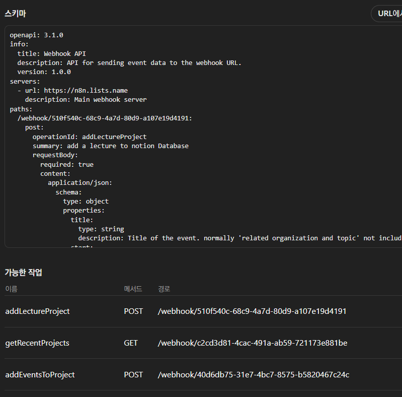

## ChatGPT App

- iOS/Android/Windows/Mac 을 지원하는 네이티브 앱
- 내장된 마이크를 통해 ChatGPT와 음성대화 가능!
	- 원어민급 영어 회화 연습 가능
	- 중간에 끊기(interrupt) 가능한 자연스러운 대화
- 향후 OS와 AI Agent 통합의 전초기지가 될 전망


# 실전 ChatGPT


## 이력서를 주고 물어보기

- PDF, PPT, XLS, DOC, TXT, MD 등 다양한 포맷의 파일을 제공하고 내용에 대해 질문하거나, 내용을 기반으로 추론하거나, 데이터 분석 등을 의뢰
- 이력서를 제공하고 아래와 같은 것들 [물어보기](https://chat.openai.com/share/73b5a668-452b-4645-a351-f76d5a22effb)
	- 현재 회사 내에 문제들을 해결하는 데에 도움을 줄 수 있는 사람일지?
	- 우리 팀에 들어왔을 때 문제가 될 수 있을만한 가능성?
- [채용 후보 관리 엑셀 파일을 작성](https://chat.openai.com/share/3ece436c-e7d3-4123-8974-5a2bd4af6caf)하고, 후보자를 추가시키기


## 회사의 재무제표 분석

- 재무제표 데이터를 주고, [이것저것 물어보기](https://chat.openai.com/share/1439534a-edf4-46ff-adf1-195e31b81ba2)
	- 이 회사의 성과가 증가한 이유?
	- 앞으로 어떤 점을 중점으로 운영해나가면 좋겠는지?
	- 한국의 현 상황과 관련하여 투자의견 제안
- 재무제표 분석 결과, 투자 관련 의견을 작성하여 보고하기


## 아보카도 가격 분석

- [캐글 - 아보카도 가격 분석](https://www.kaggle.com/datasets/neuromusic/avocado-prices)
- 미국의 일별 / 지역별로 기록된 아보카도 평균 가격과 판매량 데이터를 주고 [물어보기](https://chat.openai.com/share/f2bf4f19-2995-4cbf-9415-0e83df2287c4)
	- 같은 기간 동안 가장 많이 오른 지역은?
	- 아보카도 가격에 가장 많이 영향을 주는 요소는?

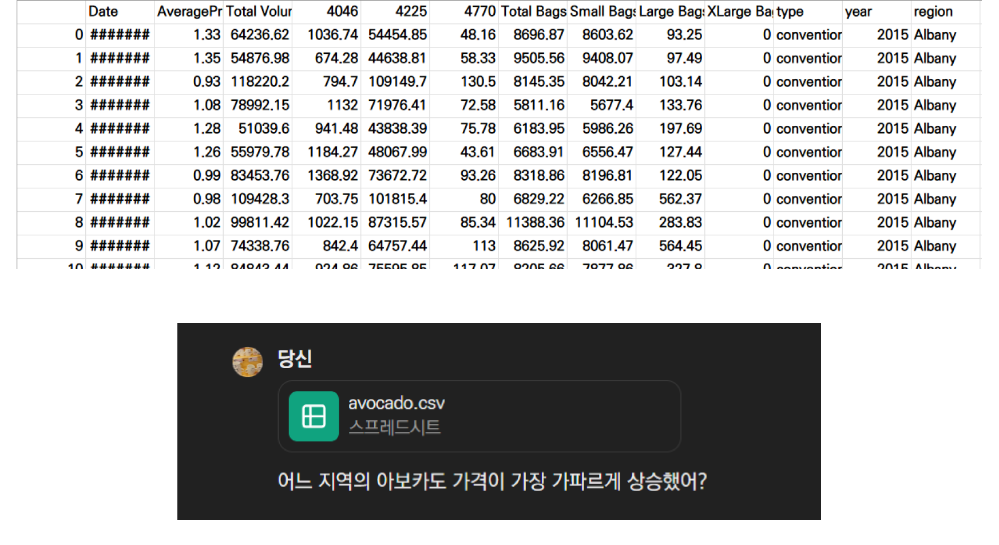

## 스포티파이 곡 재생 데이터 분석

- [캐글 - Most streamed spotify songs 2023](https://www.kaggle.com/datasets/nelgiriyewithana/top-spotify-songs-2023)
- 2023년의 스포티파이 곡 재생 데이터를 주고 [물어보기](https://chat.openai.com/share/38c1cee9-a476-4381-897f-ba107ee8b791)
	- 얼마나 많은 K-Pop 곡들이 순위에 올라왔나?
	- 2023년의 전체적인 무드는?
	- 스포티파이에 진출한 K팝 아티스트들의 비중을 파이차트로 그리기

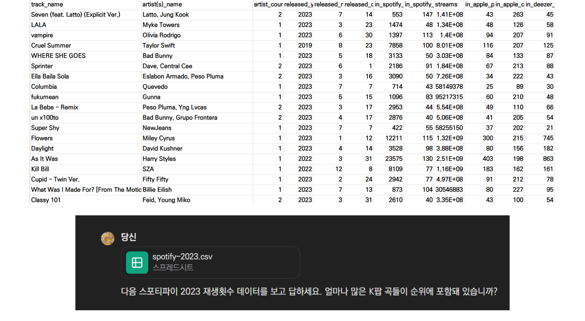

## GPTs

- PDF로 된 신입사원 매뉴얼을 학습하고, 신입사원의 질문에 답하는 GPT 만들기
	- 친절한 말투를 사용하고 긍정적인 답변을 해야함 (Tone, Attitude)
	- 신입사원 매뉴얼에 없는 내용, 곤란한 내용에 대해서는 인사팀장의 이메일 주소 안내
	- [친절한 김대리](https://chat.openai.com/g/g-bEYIII6S6-cinjeolhan-gimdaeri)


## 원영적사고 GPT 만들기

- [원본](https://getgpt.app/play/1drEpYwXhT?list=d9926747-7a55-4b38-a80d-2982de281d5f)
- 어떤 Instruction을 주었을까? 생각해보기
	1. 다소 억지스럽더라도 불합리하거나 억울하거나 불행한 상황에서 긍정적인 포인트를 발견할 것
	2. 마지막은 반드시 '완전 럭키비키잔앙🍀'으로 끝낼 것
- [까칠한 그녀 GPT](https://chatgpt.com/g/g-wIpN0ihcQ-ggacilhan-geunyeo)

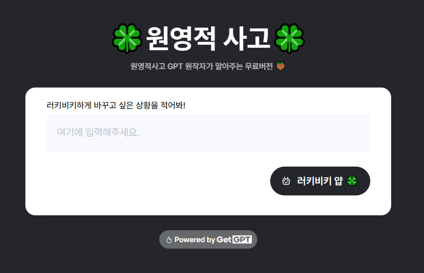

## 텍스트를 파워포인트 슬라이드로 만들기

- Chill guy 밈에 대해 알 수 있는 보고서를 GPT를 사용해 구성하고, PPT Slide로 만들기
	- Chill guy 밈이 왜 재미있는지 설명
	- 기가채드 밈과 함께, 최근 한국에서 유독 영어권 밈이 유행하는 이유에 대한 분석 포함
- 줄글을 알맞게 슬라이드로 구분하기
- 테마 적용해서 디자인 완성하기

> PPT 작성은 Python 코드로 하기 때문에 실망스러운 것이 사실

- [슬라이드 만들기](https://chat.openai.com/share/32212d7c-c30a-45ff-bf3e-fe0b39b0c2ff)


## 엑셀에서 ChatGPT 활용하기

### 샘플 데이터 만들어주기

- 엑셀에서 사용하기 위한 샘플 데이터를 생성
- 테이블 형태로 반환된 [데이터](https://chat.openai.com/share/cca1a314-d09f-4ec5-8aac-aca52131b16a)는 엑셀, 구글 시트 등에 붙여넣어서 사용
	- 또는 csv, xlsx 형태로 달라고 요청해도 됨

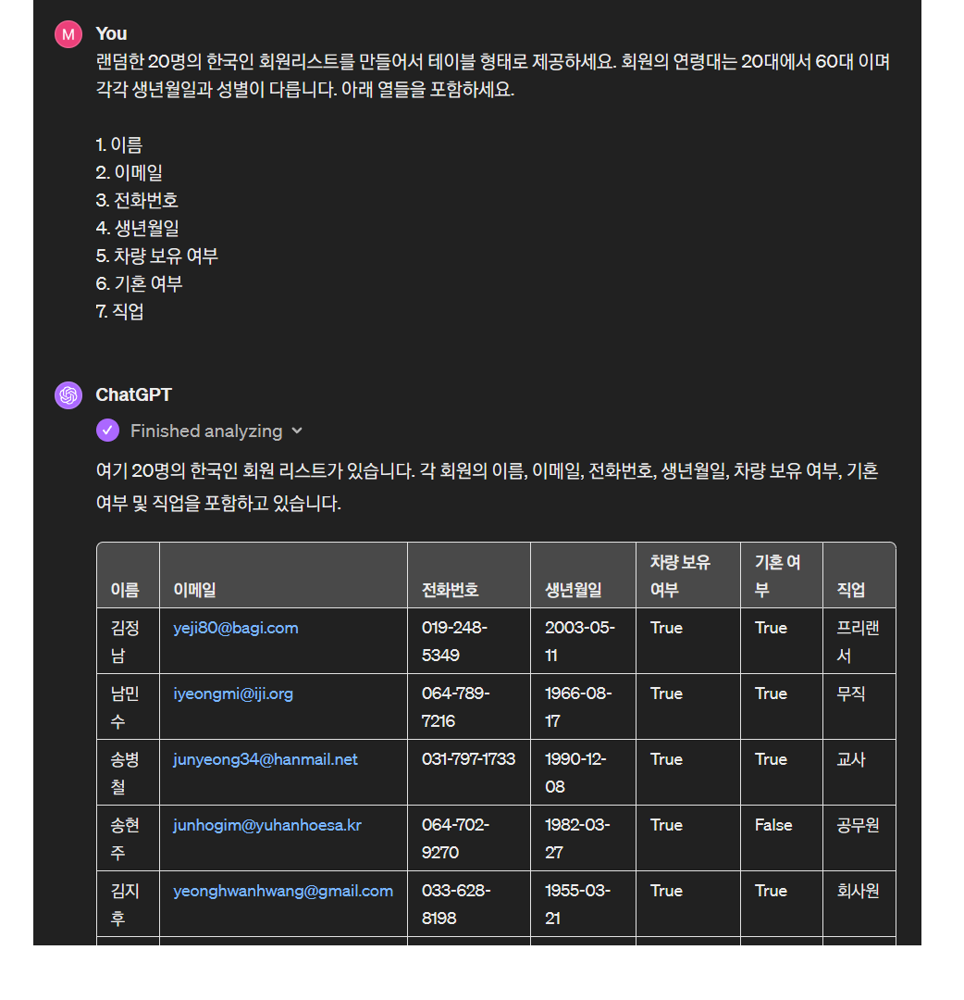

---

### 수식 대신 만들어주기

- 필요한 수식을 텍스트로 설명하면 대신 생성해줌
- 사용할 함수, 파라미터로 제공되어야 하는 데이터의 위치와 형식을 설명할 필요 있음

> 기본적으로 수식과 함수의 동작을 이해해야 정확하게 설명할 수 있다. 만약 어렵다면 스크린샷을 첨부하고 상황과 목적을 침착하게 설명해볼 수 있다
 
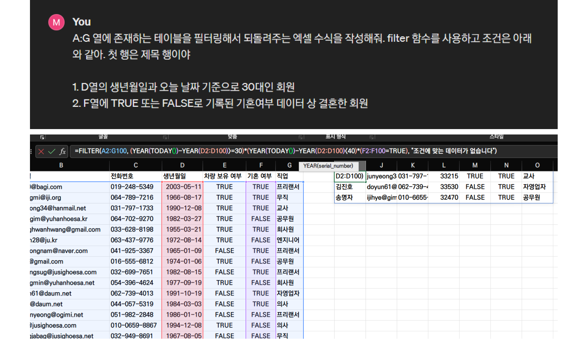

## GPT를 엑셀 안에서 사용하기

- ChatGPT API를 사용하여 엑셀 안에서 함수를 통해 GPT를 사용하게끔 도와주는 추가기능
	- [gptforwork.com](https://gptforwork.com)
- 기본적으로 유료이나, 가입시 약간의 크레딧을 제공하여 테스트해볼 수 있다

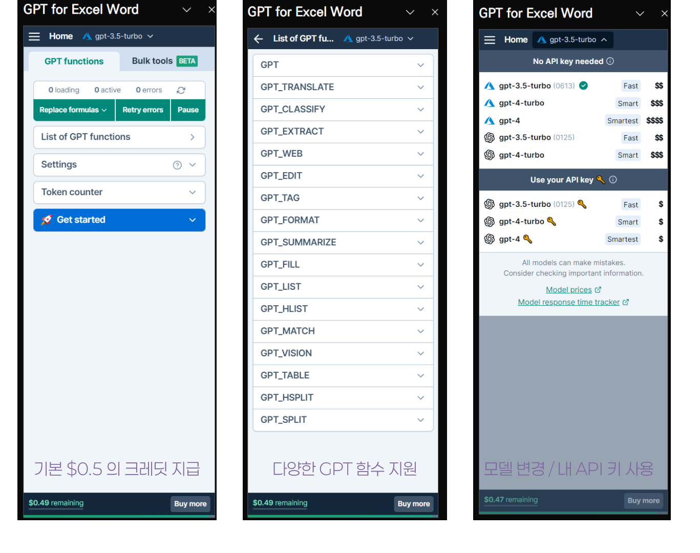

---

### 기존 데이터와 연관된 데이터 생성하기

- 회원의 이름, 나이, 직업을 고려하여 선물 제안하기
- `GPT()` 함수 사용하기

```ruby
GPT(프롬프트, [참조데이터], [온도])
```

- 온도는 ChatGPT의 창의성을 의미하는 하이퍼 파라미터 (optional)

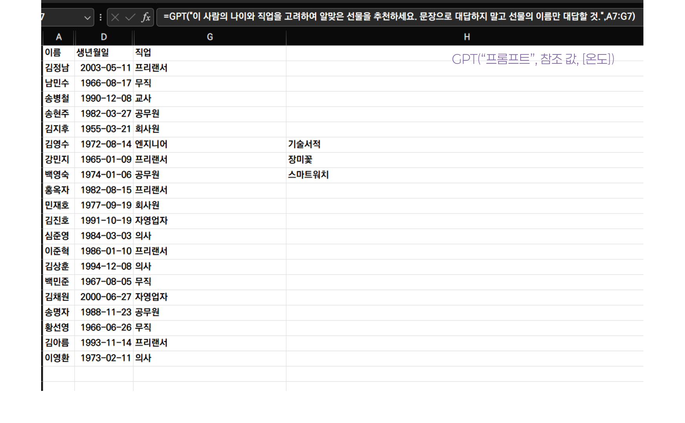

---

### 알맞은 해시태그 달기

- 여행코스에서 여행지와 체험하는 문화를 꺼내어서 해시태그 형태로 표현.
	- 무엇을 해시태그로 뽑아내야 할지 정확히 알려주기
- 드래그 핸들을 잡고 채우기(Fill) 기능을 사용해 `GPT()` 함수 반복하기

> 채우기를 사용해서 GPT() 함수를 반복할 경우 그 수만큼 API 호출이 이뤄지니 주의


---

### 내용 분류하기

- 정성적인 평가를 긍정과 부정의 뉘앙스, 그리고 긍정 부정의 정도를 평가하기.
- `GPT_LIST()` 함수 사용하기

```ruby
GPT_LIST("프롬프트", [참조값], [온도])
```

- 결과물이 배열(Array)의 형태로 반환된다. 엑셀 또는 구글 시트에서 배열은 여러 행 또는 열의 데이터로 표현되므로
	- 한 번의 API 호출로 여러 줄의 데이터를 입력할 수 있음.
	- 간혹 항목의 갯수를 헷갈리는 경우 있음.

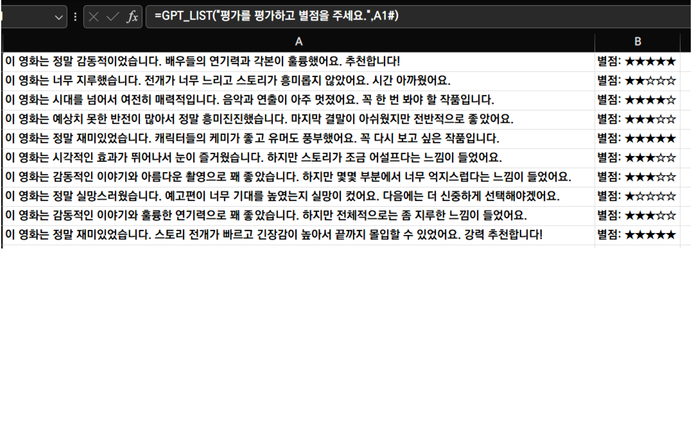

---

### 패턴 파악해서 채우기

- Before와 After의 결과값 예시를 주고 다량의 Before 값을 After 형식으로 변환하기
- `GPT_FILL()` 함수 사용하기

```ruby
GPT_FILL(패턴 범위, 입력 범위, [온도])
```

- 패턴 범위에는 몇 개의 정답을 가진 패턴을 입력해야 하고, GPT로 하여금 일정한 패턴을 발견할 수 있도록 설계되어야 함
	- 문제 범위를 헷갈리지 않도록 주의

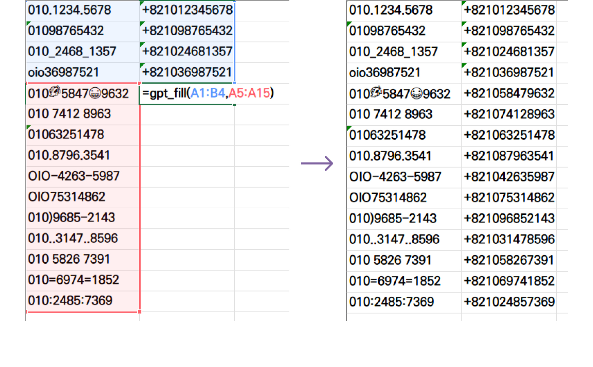

## OpenAI API Key 발급

1. [https://platform.openai.com](https://platform.openai.com)으로 이동 및 로그인
2. 설정(Settings) - API Keys로 이동
3. Create new secret key
4. 이름과 프로젝트를 입력하고 Create Secret Key
	- API키의 이름은 여러 개의 키를 발급했을 때 어디에 썼던 키인지 기억하기 위해 쓰는 것
	- 프로젝트는 Default Project로 해도 무방
- 생성 직후에만 키를 확인할 수 있으므로 잃어버리면 재발급을 해서 사용
	- 이 때 기존 키는 반드시 폐기해야 한다.

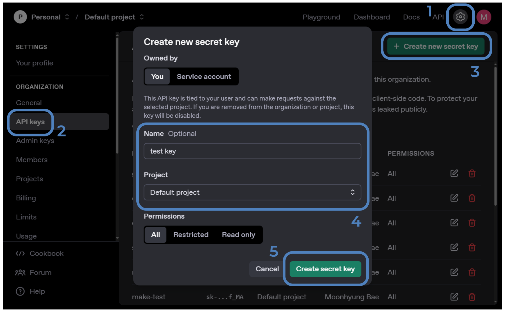


## VBA

- Visual Basic for Applications
	- 파워포인트, 엑셀 등의 기능을 조작하는 스크립트 언어로, (상대적으로) 쉬운 문법과 오피스에 구석구석 통합되어 있어 많은 작업을 줄일 수 있음.

### 두 가지 사용 방식

- 매크로
	- 엑셀의 일련된 작업들을 VBA를 통해 자동화할 수 있음
	- 버튼 또는 UI 컨트롤을 추가하여 트리거 기반의 자동화 과정을 실행
- 사용자 함수
	- 기존 엑셀 함수에 더해 사용할 수 있는 사용자 커스텀 함수를 VBA로 제작할 수 있음

## 근태 체크 엑셀 매크로 만들기

- 출근/퇴근 버튼을 누르면 근태 시트에 자동으로 출퇴근 시간이 적히도록 엑셀 매크로 작성
	- 다음과 같은 기능을 하는 엑셀 VBA 매크로를 작성해줘. 버튼을 누르면 "근무자" 시트의 A1셀에 적혀있는 근무자 이름을 가지고 "출퇴근" 시트에 한 줄을 기록. A열에는 근무자의 이름, B열에는 "출근" C열에는 현재 시간을 적어줘

> 코드를 요청하는 프롬프트보다 사실은 버튼을 배치하고 그 버튼의 동작을 구상하는 것이 훨씬 중요하다.

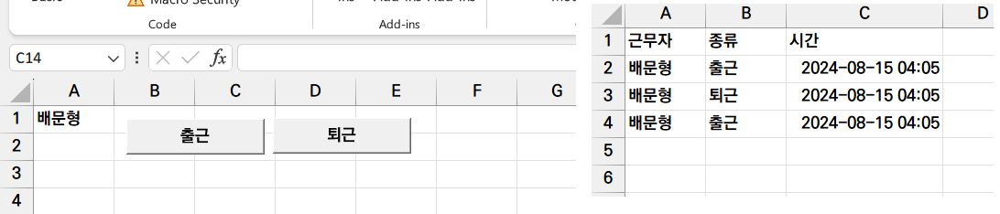

## 파일명 변경 엑셀 만들기

- 폴더 내 파일명을 일괄 변경해주는 엑셀 매크로 만들기
- "다음과 같은 기능을 수행하는 엑셀 VBA 매크로를 작성해줘"
	- 버튼을 누르면 A1열에 적혀있는 시스템 경로의 폴더의 모든 파일명을 불러와서 B열에 한줄씩 적는 매크로
	- 버튼을 누르면 B열의 각 행에 있는 A1셀의 시스템 경로의 파일명을 C열의 대응하는 각 행의 변경된 이름으로 변경하는 매크로. 단 B열과 C열의 이름이 같은 경우 처리하지 말 것.

> 사실은 이미 누가 예쁘게 만들어둔 편리한 매크로가 있으니 이런 것도 할 수 있다는 걸 실습하고 참고만 하고 이쪽을 쓰도록 하자.

- [파일명 변경 매크로](https://m.blog.naver.com/dowahn/130114764344)

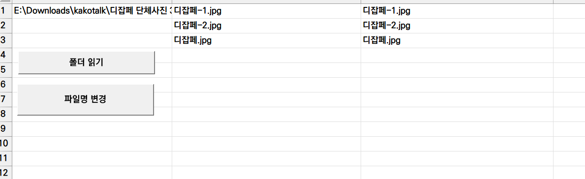

## ChatGPT를 엑셀에서 사용할 수 있도록 커스텀 함수 만들기

- GPT API를 사용해서 답변을 셀에 적어주는 `GPT()` 함수 만들기
	- 다음과 같은 엑셀 사용자 함수를 생성하는 VBA 코드를 작성해줘. OpenAI의 API를 사용해서 ChatGPT의 Chat Completion을 수행하고 그 응답을 셀에 적어주는 사용자 함수. API에 사용할 모델명과 API키를 상수로 맨 앞에 선언하고, 사용자 프롬프트, 참조 범위, Temperature를 매개변수로 받을 것. 참조 범위와 Temperature는 Optional한 매개변수야. 

> 엑셀에 내장된 VBA는 JSON을 처리할 수 없기 때문에 VBA-JSON이라는 모듈을 설치해야 한다. GPT가 따로 언급해주지 않으면 'JSON' 모듈 설치에 관해 물어보고 시키는 대로 할 것.

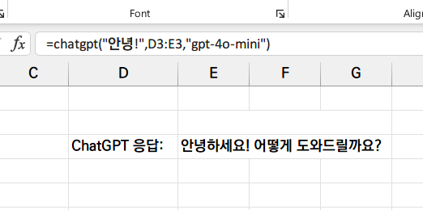

# 감사합니다