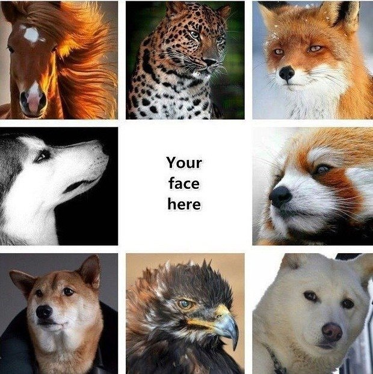
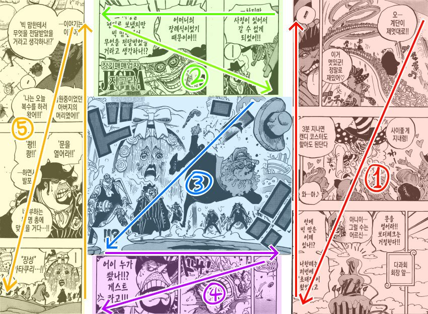

## 포트폴리오의 형식

### 포맷

가장 스탠다드하고 범용성있는 포트폴리오의 포맷

1. 출력용
	- 면접장에서 출력물로 당신을 처음 만나게 될 면접관을 위해
	- 출력이 고려된 디자인, 포맷을 사용하기
	- 어디 이렇게 한 번 해보든지, 어떻게 되나:
		- 마트 영수증 비율로 포폴 만들기
		- 배경 새까맣게 칠하기
		- 글씨 조막만하게 쓰기
2. PDF
	- 인터넷 연결 또는 프로그램 설치 없이 읽을 수 있으며
	- 환경에 상관없이 글꼴 등 포맷이 망가지지 않음
	- 용지 사이즈가 정의되어 있음 (출력용임)
3. 프레젠테이션
	- PT를 요구하는 면접에서 즉시 PT할 수 있고
	- 가독성이 좋은 문서 형식

### 깃헙, 노션 등의 온라인 프로필

- 회사/사람에 따라 다르나, 기본적으로 보려 하지 않음.
	- 어디까지나 옵션(Option)
	- 있으면 좋은 것. 이것만 있으면 안 됨
	- 이것만 제출하는 경우 상당히 성의가 없어보임.
- 그러나 인터랙션, 프론트엔드, 영상 등의 미디어를 보여주기 위해 필요하기도
- 온라인 프로필, 굳이 만든다면 웹사이트 형태가 가장 성의있고 그만큼 부담스럽다
	- 개발자는 깃헙 프로필 필수로 제공

## 포트폴리오에서 가장 중요한 것

### 범용성

- 포트폴리오를 읽는 사람이 누가 될지 알 수 없기에
- 누구에게도 받아들여지는(acceptable) 포트폴리오를 작성하는 것

### 읽는 데에 `노력`이 적게 드는 것

- 채용담당자, 면접관은 기본적으로 **노력하고 싶지 않다.**
- 읽는 사람의 노력을 일종의 화폐라고 생각하고, 
	  - 이것을 최대한 지불하게 만든다
	  - 궁금하게 만들고, 노력을 대가로 궁금함을 해소해주기

### 성의

- 많은 포트폴리오들 사이에서 내 것을 돋보이게 하는 방법
- 우리가 소개팅을 나갈 때 차려입는 이유?
- 포폴 디자인 외주를 주는 것도 전혀 오바 아님

### 남들과 다를 것, 남들보다 나을 것

- 어디까지나 많은 포트폴리오들 사이에 내 것이 보여진다고 생각해야
- 최소한 남들과 비슷한 수준을 만들어놓는 것이 출발선

## 내 포트폴리오를 읽는 데에 드는 노력을 줄이기

### 웹툰을 생각해보자

- 면접관, 채용담당자가 포트폴리오를 보는 마음은 웹툰을 보는 우리의 마음과 비슷
- 집중력을 십분 발휘해서 웹툰을 읽는 사람은 없다.
	- 왜냐? 웹툰은 원래 그렇게 쓰여졌다
		- 지하철에서 서서
		- 자기 전 누워서
		- 화장실에서 바지 내린 채 읽어도
		- 상황과 디테일을 모두 파악할 수 있다
	- 컷당 배치된 말풍선과 캐릭터의 갯수가 적음

### 일관된 흐름

- 웹툰 읽듯이 빠른 속도로 스크롤을 내려도
	- 내용을 파악하기 위해 **집중, 노력을 하지 않아도**
	- 이 사람의 성향, 역량, 강점, 약점이 모두 머릿속에 흘러들어오는 포트폴리오
- 이런 것은 포트폴리오가 **하나의 일관된 흐름**으로 완성되어 있어야 가능
	- 흐름은 요소가 모두 연결되어 있는 것.
	- 이는 즉, 항상 **다음 내용이 예상되도록** 만들어야 함을 의미
		- 다음 내용을 예상하고 다음으로 내려가는 것과,
		- 아무런 단서 없이 다음 내용이 눈 앞에 들이밀어지는 상황은 
			- 다음에 예상한 내용이 나오든, 예상 못한 내용이 나오든 상관없이
		- 눈 앞의 것을 파악하는 데에 들여야 하는 **노력의 양** 측면에서 완전히 다름.
	- 목차를 넣는 것이 아주 좋은 Practice

### 강조하고 싶은 부분을 귀엽게 강조하기 (귀엽게에 밑줄 쫙)

- 내가 포트폴리오에서 특별하게 자랑하고 싶은 부분이 있는 것처럼,
	- 읽는 사람도 이 포트폴리오에서 어떤 부분을 특별히 자세히 봐주어야 하는지 궁금하다.
	- 그리고 그걸 직접 읽어가며 찾기 귀찮다. 
- 그렇다면 내가 먼저 이 부분을 봐달라고 **귀엽게** 강조하는 것이 뭐가 나빠
	- 귀엽고 솔직하게 하는 것이 중요 ㅋㅋ
	- 잘난 척, 멋있는 척을 하려다가는 비호감이 될 수 있다
- 이렇게 강조되어 머릿속에 각인된 프로젝트, 내용은 또한 면접에서 질문거리가 될 수 있으므로
	- 당일에 주어지고 그저 받아들여야 하는 것이 당연하게 느껴지는 면접이라는 것 역시
	- 역으로 내가 설계할 수 있는 강력한 무기가 될 수 있다
- 출력용 포맷에서 보여주기 어려운 인터랙션, 멀티미디어 포맷의 산출물(링크를 눌러야 하는..)들을 귀엽게 강조해보자
	- 무작정 츄라이츄라이~하며 입에 떠 넣어주기보다,
	- 이거 어때요? 맛있게 생겼죠? 함 잡솨봐~ 라는 느낌으로

## 분량은 문제가 아니야

### 스크롤 내리는 건 그렇게 안 힘들어요

- 웹툰 볼 때 길다고 스크롤 내리는 게 힘든가요?
	- 이것도 힘들면 웹툰 보지말고 그냥 릴스나 봐 ..
- 진짜 힘든 건 포폴의 분량이 많은 게 아니고 **재미없고 불친절한 거**
	- 大 도파민의 시대
	- 재미없는 데다 길기까지 해봐 아주

### 내 포폴이 재미없어지는 이유

- 지 하고 싶은 말만 함.
	- 저는 이렇게 뛰어난 개발자이고 이러한 경험이 있고
		- 잘난 척 멋있는 척 × ∞
	- 분량에 대해 고민한 끝에 딱 빼면 안되는 것만 남기고 다 빼는 거지
- 그냥 누구나 듣기 좋은 준비된 답변 / 퍼스널 브랜딩
	- 100명 중 95명이 똑같은 거 들고 옵니다.
		- 사용자와 공감하는 개발자
		- 배움과 성장을 좋아하는 개발자
		- 협력과 소통을 중시하는 개발자
- 억지로 짜낸 기색이 역력한 프로젝트 회고
- 가독성이 너무 안 좋음
	- 원피스 요즘 재미없죠? 왜 재미없을까?

