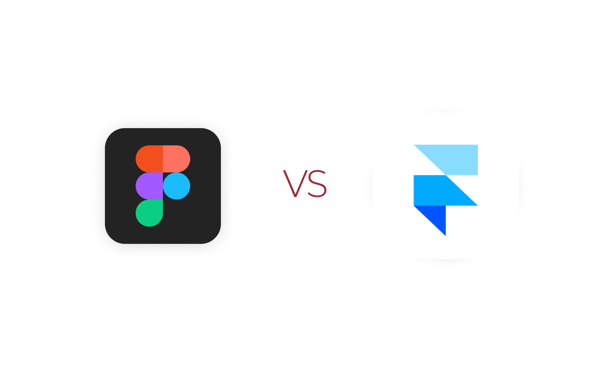
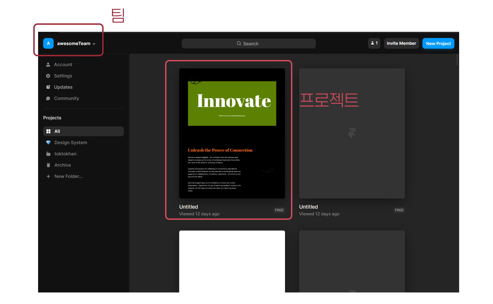
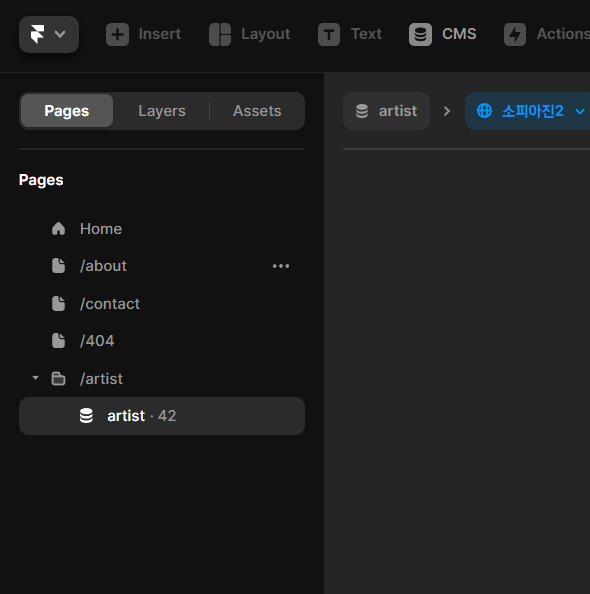
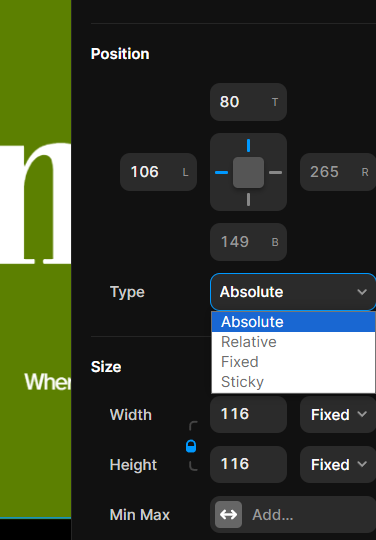
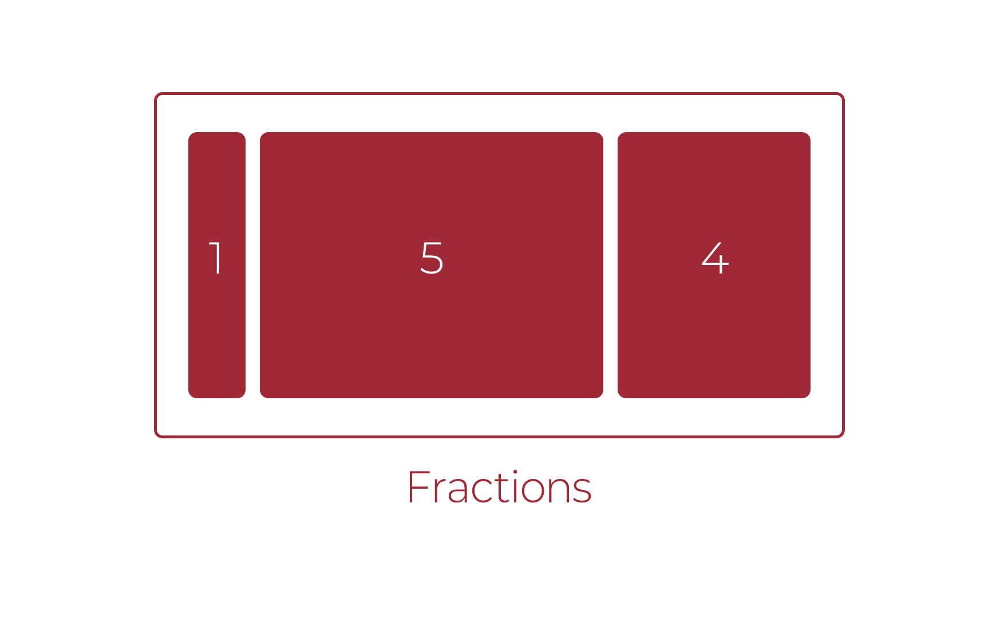
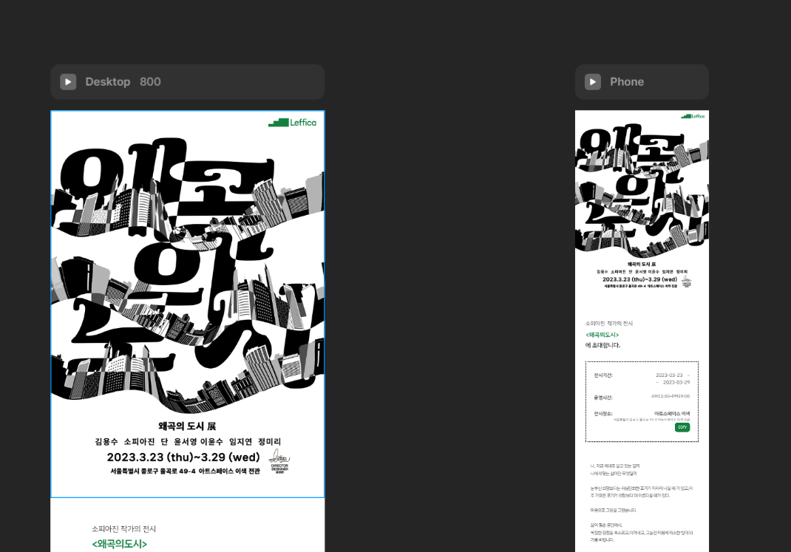

# 프레이머 알아보기

## 프레이머

- 피그마와 같은 프로n타이핑 도구
	- ...였으나 현재는 웹사이트 빌더로 피봇
- React.js 기반 컴포넌트를 사용
	- 따라서 노코드이면서 로우코드
- Framer.js
    - Framer Studio (Coffee Script)
    - Framer Classic
    - Framer Web
- [지금, 툴이 아닌 틀을 바꿔야할 때](https://www.youtube.com/watch?v=OWQlHgEo7Hw)

---

### 하이브리드 앱

- 웹사이트인데 앱처럼 보이게 만든 것
	- React.js
			- 프론트엔드 프레임워크
			- 컴포넌트
- 국내에선 토스에서 사용해서 유명해짐
    - 연 15,800 시간을 절약했다!
    - 토스는 네이티브 앱이 아닌 하이브리드 앱
    - 프레이머가 웹빌더로 피봇팅을 하면서
        - 디자인 도구로 사용하기가 불편해짐
        - 토스는 Deux 라는 이름의 별도 도구를 만들고 있다는 소문

## React.js

- Vue.js / Angular.js 등과 나란히 프론트엔드 삼대장이라 불리움.
- 작은 부품을 조립하여 화면을 구성하는 컴포넌트 방식의 디자인
- SPA(Single Page Applcation)를 작성하는 데 사용됨

---

- 웹의 Stateless함
    -  웹은 모든 접속에 대해 상태를 유지하지 않는다.
        - 두 번 접속해도 원칙적으로 별 개의 연결
    - ‘깜빡’

- SPA는 앱과 같은 경험을 주기 위해 전체 새로고침을 하지 않고, 일부만 새로고침하는 컴포넌트 방식을 찾아냄.

## 프레이머가 노코드라면 무엇이 가능한가?

### UI: 9/10

- 스크롤, 호버 등의 다양한 트리거를 사용한 효과 사용 가능
- React.js를 사용한 심리스한 SPA 구현

### 로직: 4/10

- 컴포넌트를 사용한 UI 상태 변경
- 다채로운 인터랙션을 구현할 수 있음.

### DB: 4/10

- Content management System (CMS)를 사용한 템플릿 페이지 작성 가능
- 외부 API와 같은 연결 불가

## 피그마와 다른 점

- 오로지 Frame을 사용. 
- 완성된 페이지는 React 기반의 웹사이트로 Publish 가능
- 웹사이트를 위한 세팅 기능
    - 라우팅/도메인/SEO 등등
- 처음부터 반응형 디자인을 위한 Breakpoint 전제
- 컴포넌트와 인스턴스의 관계가 엄격함
	- 컴포넌트는 별도의 편집 페이지를 사용
- 호버, 스크롤 등의 다양한 효과 구현

## 팀

- 모든 프레이머 문서(프로젝트)는 팀에 귀속됨
- 다른 사람들과의 협업을 위해서는 결제가 필수
- 프레이머 문서는 삭제가 불가능하고 오로지 Archive만 가능

### 프로젝트

- 모든 프레이머 프로젝트는 그 자체로 웹사이트
- `프로젝트명.framer.website` 라는 기본 도메인이 지급 됨.

## 페이지(Pages)

- 프레이머 프로덕트를 구성하는 단위
- 웹 / CMS / 폴더
    - 웹: Publish 했을 때 인터넷에 배포되어서 주소로 접근할 수 있는 페이지
        - `도메인/페이지 이름` 으로 접근할 수 있음.
    - CMS: CMS 컬렉션으로 자동 구성되는 웹 페이지
    - 폴더: 폴더를 사용하면 최종적으로 URL은 `도메인/폴더명/페이지명`이 된다

## 레이어와 프레임

- 레이어와 프레임은 피그마와 거의 동일하므로, 피그마를 참고하면 좋음.
- 피그마와 다르면서도 좀 더 개발에 가까운 도구이므로, 개발로부터 근거를 찾으면 유리
- 특히 Overflow를 다루는 부분은 CSS의 div 태그를 다루는 것과 상당히 유사
    - Hidden
    - Visible
    - Scroll

- **Pin**: 자식 요소를 어딘가에 고정시켜두는 것.
	- 피그마의 Constraints와 같은 개념

- **Position**: 자식 요소의 포지셔닝을 결정
	- Absolute: 부모 위치/크기에 따른 절대적 위치를 고수
	- Fixed: 스크롤 위치에 연연하지 않고, 그 위치에 고정된다. 광고 배너 등에 사용

## Layout (Stack)

- 피그마의 Auto Layout에 해당
- Row / Column / Grid 로 나뉘고
- Fit / Fill Layout
	- 부모가 자식 크기에 맞추거나
	- 자식이 부모 크기에 맞추거나
	- 둘 다 상관없든가.
- Fraction
	- 자식을 배치하는 경우, 자식이 차지하는 부모 컨테이너 영역에서의 비율.

## 프레이머의 단위

- 길이의 단위
    - Pixel
    - em
    - % (relative)
- Resizing
    - Fixed: 피그마와 동일. px 단위로 고정값 입력
    - Relative: 부모 크기의 %
    - Fill: 피그마의 Fill Container에 해당

***

### Viewport Height(vh)

- Viewport란 브라우저 창의 표시 영역을 말함.
- vw(Viewport Width)는 사용할 수 없으나, 텍스트를 부모 컨테이너에 Relative한 크기로 만들 수 있음.

### Fraction

- 몫
- 자식요소들이 Fill 속성을 가질 때 각 자식들이 얼마나 영역을 차지할 지에 대한 비율을 표시함.
- 자식의 크기는 `해당 자식의 Fraction / 전체 자식의 Fraction의 합`

## Breakpoint

### 붕괴지점

- 화면 크기가 다른 여러 디바이스에서 동일한 콘텐츠를 보여주기 위한 하나의 페이지, 즉 반응형 레이아웃을 만들 때 각 타겟 디바이스의 기준점
- 해당 포인트의 가로 너비(width)로 정의된다.  
- 프레이머에서는 Desktop BP가 메인 컴포넌트처럼 작동하여
	- 인스턴스에 해당하는 하위 BP가 Desktop BP의 변경사항을 상속

## 컴포넌트

- 피그마의 그것과 달리 컴포넌트의 인스턴스에서 변경될 수 있는 부분은 반드시 Property(Variable)의 형태로 만들어줘야 함.
    - 피그마의 Component Properties 에 해당
- 컴포넌트는 그 자체로 외부와 단절된 완결된 세계
	- 그러나, 상위 컴포넌트로부터 값을 내려받는 것만 가능(Props, Properties)
	- 또한 이벤트를 바깥으로 보낼 수 있다

---

## Variables

- Property를 컴포넌트의 내부에서는 Variable로 정의.
	- Variable을 정의하면 외부에서는 Property의 형태로 표현됨
- 컴포넌트의 내부에서 사용되는 **값 또는 이벤트**를 정의하여 내부에서 사용
- Color 등 피그마보다 다양한 설정 값을 사용할 수 있다는 것이 장점
	- Variable의 정의가 좀 더 명시적이기 때문에, 다소 어렵게 느껴질 수 있음

### Event

- 이벤트 또한 Variable로 만듦으로써, 인스턴스에서 발생한 이벤트를 상위 컴포넌트에 전달할 수 있다
	- 그러나 노코드에 한정한 프레이머에서의 활용은 클릭 이벤트에 한함.

## Variants

- 피그마와는 달리, 모든 하위 Variants는 또한 Primary Variant의 인스턴스임.
	- 따라서 기본적으로 모든 Variant는 Primary Variant의 속성 값을 상속하며, 레이어 구조를 변경할 수 없음
- 클릭 이벤트를 위한 Hover/Pressed Variants는 별도의 차원(Dimension)으로 배치됨
- 상위 프레임의 Border는 모든 것의 위에(Z축 상) 있으므로, Variant를 활용할 때 주의

## Transitions

- 프레이머에서 애니메이션을 구현하는 방법은 요소 자체에 Transition 속성을 정의해놓고, 이 요소가 다음 프레임 또는 Variant에서 변경될 때 요소 자체적으로 가지고 있는 Transition 속성을 참고하여 애니메이트하는 것.
	- 선언형(Declarative)이라고 한다
	- 따라서 다음 프레임/Variant에서 두 개의 요소가 동일한 요소로 판정될 필요 있음.
		- Variant에서는 레이어 구조가 변경되지 않으니 문제가 없음.
- 즉 요소의 전후상태를 일종의 키프레임으로 만들어 사잇값을 요소의 프로퍼티를 사용해 생성하는 형태로 작동하게 된다. 이 때 Transition 속성이 요소에 종속되는 것에 주의