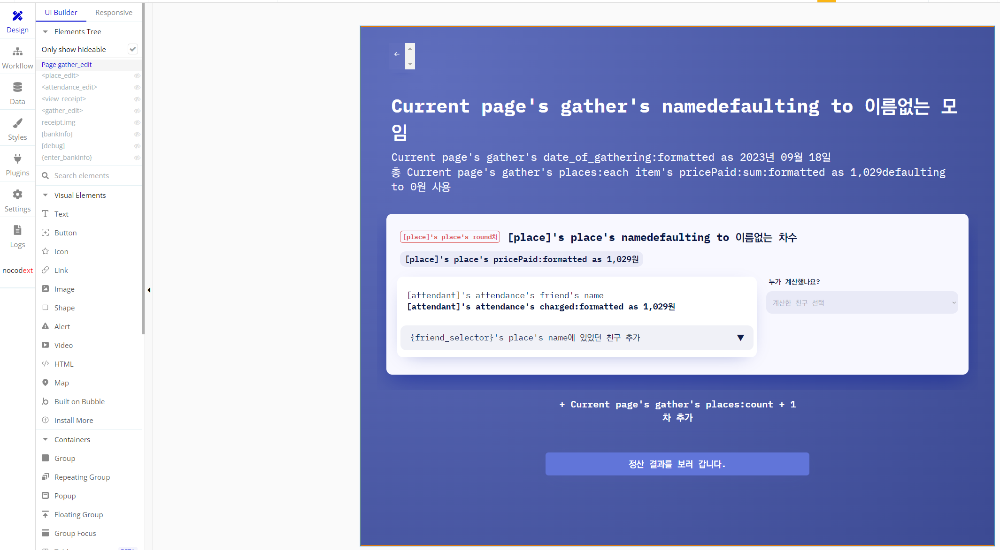

# 노코드 개론

## 노코드 엔지니어링이란

- 노코드로 제품을 구현하는 것.
- 로우코드
	- 약간의 코딩을 더해 강력한 기능성을 갖는 노코드 툴=

## 왜 노코드인가?

- 쉽다.
	- 검은 화면에 텍스트를 보며 작업하는 것이 코딩의 진입장벽
		- 노코드 툴은 GUI를 사용해서 WYSIWYG 환경을 구축
			- What you see is what you get
	- 쉽기 때문에 프로그래밍의 학습을 보조하거나 진입장벽을 낮춰주는 효과가 있음
- 빠르다.
	- 개발의 많은 부분이 컴포넌트화, 모듈화되어 있고
		- 뚝딱뚝딱 가져다 쓰면 됨
	- GUI를 사용하기 때문에 설계가 직관적임.

---

- 저렴하다.
	- 개발 작업 측면:
		- 쉽고 빠르기 때문에 인력 부담 적음
	- 서비스 측면:
		- 작은 서비스인 경우 인프라 구축에 대한 유지비용이 적음
- 1인 창업
	- 많은 인력이 필요치 않기에 혼자서도 MVP 등의 제작을 통해 PMF 검증 가능
		- Product-Market Fit

## 노코드의 단점

- 느리다.
	- 대체로 노코드 프로덕트 구동을 위한 상위 레이어 기술을 필요로 하므로 순수 코드로 작성된 앱보다 느릴 수 있음.
	- 느리고 로직을 최적화하기 어렵기 때문에 대용량 처리에 불리함
- 확장이 어렵다.
	- 제품의 검증 후 사용자가 늘어나거나 트래픽이 늘어나서 확장이 필요한 경우 구조 변경이나 기능 확장이 제한됨
		- 규칙(컨벤션)을 잘 지켜서 만들어야 한다.
- 코딩에 비해 제한된 기능
	- 마음껏 코드를 사용해 기능을 구현할 수 있는 것에 비해, 기능이 제한되고 타협해야하는 필요 있음.
		- 와 이게 돼?
		- 와 이게 안돼?

## 노코드와 AI

- 생성형 AI의 출현은 컴퓨터에게 '대답을 하는 능력'을 준 것이라고 볼 수 있음
	- 사람이 직접적으로 컴퓨터에게 명령을 하는 것에서 컴퓨터에게 목적을 말하는 형태로 이행해갈 것. 
- 강인공지능 (스스로 코딩하는 인공지능)으로 가기 위한 중단단계로서의 노코드.
	-  현재는 약 인공지능과 노 코드 툴로 사람이 직접 필요한 기능을 개발하는 과도기에 있음.
- 강인공지능이 대중화되었을 때, 그 땐 앱이라는 게 존재할까?
	- 애플리케이션, 웹 사이트 등의 인터페이스는 사람이 쓰기 위한 것. 사용자가 직접 서비스에 접근하지 않고 비서 형태의 AI가 스스로 사람을 위한 해결책을 구상하고 실행하는 시대가 오면, 애플리케이션이나 웹 사이트 등의 필요도 없어질 가능성이 큼.
	- 물론 사람이 직접 개발할 일도 없어질 것

## 노코드가 중요해지는 이유

- 오랜 시간 성숙된 애자일 문화
    - 워터폴 방식 개발 방법론의 한계를 해결하기 위한 대안
    - 빠른 프로토타입과 테스트를 반복해가며 개발
        - 노코드의 신속성과 직관성이 필요한 영역
- 생성형 AI의 출현
	- 생성형 AI는 코드 또는 발화의 형태로 대답을 할 수 있음
	- 이 대답을 노코드(GUI)로 할 때 사람과 대화하기가 훨씬 유리

---

- 코로나 이후의 변화
    - 세계경제 악화
    - 투자 시장의 변화
        - 기존: 미래가치에 투자
        - 현재: 현재수익/성과에 투자
            -  검증된 아이디어. 검증의 필요성 증가
                - 빠른 검증(MVP)을 위한 노코드

---

- 코로나 이후의 변화
    - 개발비용 증가
    - 온라인 의존도 높아짐
        - 온라인 커뮤니티의 부상
        - 위성 형태로 세분화되는 인터넷
            - 작은 규모의 인터넷 커뮤니티를 만들기 위한 노코드

## 노코드 도구의 종류

- 브론즈 ~ 골드
	- 노션 : 정보 제공 위주의 웹 페이지 제작, 데이터베이스 활용
	- 피그마 : 벡터 디자인 및 UI 제작 도구
	- 구글 시트 : 스프레드시트 형식으로 데이터를 관리하며, API를 통해 DB로도 활용
	- 소프터/글라이드/아임웹 : 초심자도 쓰기 좋은 웹 빌더

---

- 다이아 ~ 플래티넘
	- 프레이머: 리액트 컴포넌트를 사용하는 웹페이지 빌더. 코드 사용 가능(Low-code)
	- 웹플로우: Code export를 지원하는 노코드 웹 빌더
	- 에어테이블: 스프레드시트와 같은 테이블 데이터를 기록/관리.
	- 재피어: 업무 자동화와 백엔드 기능을 구현할 수 있는 노코드 도구

---

- 마스터
	- 버블: 프론트엔드/백엔드/DB를 모두 가진 전천후 웹 애플리케이션 빌더
	- 플러터 플로우: 플러터(Flutter) 기반의 노코드 도구. 코드 사용가능(Low-code)
	- 싱크트리: 블록코딩형 백엔드 노코드 도구

## 무엇을 할 것인가?

- 목적을 달성하기 위해 정해진 도구는 없다.
- 도구가 제품을 결정하거나, 제품이 도구에 의존해서는 안 될 것.
- 프로불편러, 서바이벌리스트의 정신으로
- 문제의식에서 출발하여, 세상에 어떤 가치를 실현하고자 하는지 명확한 비전 필요.

## 어느 수준으로 만들 것인가?

- 노코드 엔지니어링은 쉽고 빠른 대신, 기술적으로 복잡한 기능 구현이나 대용량 처리에 약점이 있기 때문에, 특히 스타트업의 초기 제품의 시장성을 검증(Product-Market Fit) 하는 데에 유용하게 사용됨.
- 빠르고 저렴한 노코드로 프리토타입, MVP를 구현해서 시장성을 검증받은 뒤, 투자 등을 통해 실제 개발로 스케일-업 하는 전략

---

- 프리토타입 (Pretotype)
	- 아주 기초적인 수준으로 작동하거나, 심지어는 작동하지 않아도 작동하는 것처럼 보이는 가짜 제품
	- **“fake it** till you make it”
	    - [유의미한 실패는 성공의 어머니, 프리토타입](https://blog.wishket.com/유의미한-실패는-성공의-어머니-프리토타입pretotype/)
- MVP (Minimum Viable Product)
	- 최소한의 가치를 달성하는 것을 목표로 하는 최소 기능 제품

